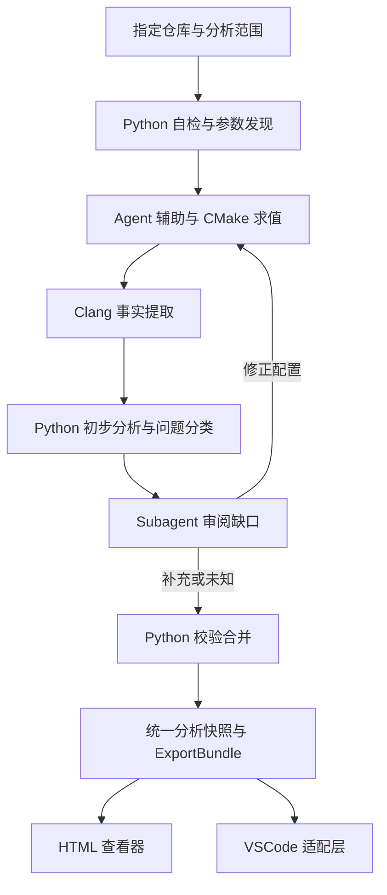
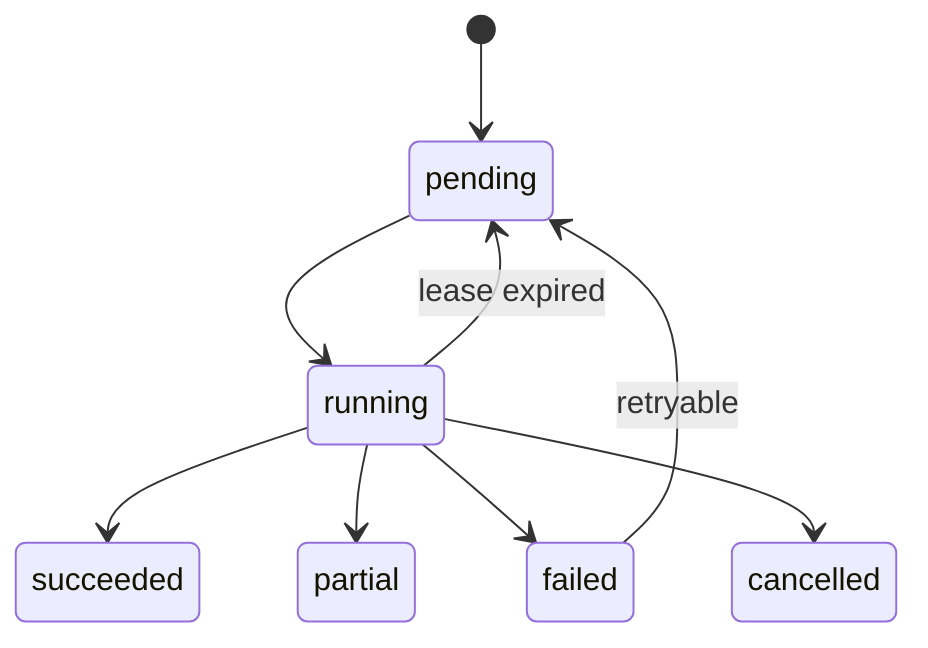

# SDK 代码总览与数据流分析工具
## 总体详细设计与原型实施规范 · v3.1

**当前主流程（v3.0，用户指定替换）：用户指定仓库 → Python 环境检查与调度 → Agent 参数确认和 CMake 调查 → CMake 求值 → Clang 提取 → Python 初步分析与问题路由 → Subagent 审阅 → Python 校验合并 → 统一仓库分析数据。该数据是后续 HTML 的唯一语义输入。** 接口驱动、按需分析与 commit 局部维护继续保留；旧版 Agent 主导全文探索、Clang 仅作可选增强的流程不再适用。

编写日期：2026-09-06。文档状态：可供编码准备与原型实施的设计基线；正式产品架构待原型验收后确认。临时代号：SDK Code Atlas，CLI 名称 `sdk-atlas`；代号不构成最终产品命名决定。

**阅读约定。** “必须”是实现与验收约束；“默认”是本设计为消除歧义提出的可执行选择，不冒充用户已逐项批准；“后续”不得在首版界面宣称已支持；“待实测”表示本轮只完成源码/文档查阅，没有完成编译、性能测试或原型运行。所有示例协议、配置、SQL/伪代码均是设计产物，不表示软件已经存在。

**交接入口。** 新接手的 Agent 必须先读第 0 章当前流程规范，再读第 1、3、4、7、11、13、15、18 章，按第 0 章新分析流水线实施。禁止先用手工硬编码关系画一张图，然后宣称通用解析器已完成；人工整理的关系只能用作独立核对样本。不得在原型验收之前自行开始正式 VSCode 插件项目编码。

---

## 目录

0. 当前主流程：从仓库到统一分析数据
1. 目标、范围与设计约束
2. 用户流程与交互规范
3. 核心概念与分析边界
4. 总体架构与模块契约
5. 仓库接入与构建上下文
6. 基础索引建立机制
7. 统一数据模型与存储
8. 调用关系、入口与路径选择
9. 参数、字段与计算链
10. 数据对象、注册与生命周期
11. Skill 与 Agent 分析协议
12. 调度、Checkpoint 与恢复
13. 按 Commit 增量维护
14. HTML 与 VSCode 集成
15. llama.cpp 原型实施方案
16. 验证与验收
17. 性能、局限与多语言扩展
18. 阶段计划、决策与交接
附录 A：端到端演算样例
附录 B：协议与错误字典
附录 C：需求追踪矩阵
附录 D：证据与参考来源
附录 E：中间文件与交接契约

---

## 0. 当前主流程：从仓库到统一分析数据

### 0.1 边界与输入

本流程正式替换 v2 的 Agent 主导轻量流程。对用户，入口是“指定仓库”；对下游，出口是“Python 生成的仓库类型、对象、函数、调用、参数流、状态事件和证据数据”。Clang 是主事实提取器，Python 是控制/分析/合并程序，Agent/Subagent 处理配置与语义缺口。HTML 不直接消费 Clang 输出，不自行解析源码。

最小输入为仓库路径（URL 接入可先准备本地 checkout）；Python 发现 CMake 入口与相关参数，再由 Agent 集中询问不能自动确定的值，例如 TOP_DIR。接口不是接入仓库的强制参数：支持 scope=repository|target|interface。repository 覆盖选定配置的可用 target/TU；target 限选定目标；interface 从指定接口所在 TU 开始按调用需要增量扩大。保留此前接口优先的轻量使用方式，不把选定接口结果伪装成全仓库覆盖。

跨仓依赖用 workspace manifest 记录各源码根、版本或内容清单、相对路径映射和各自配置。系统/内核函数可只提供声明与必要头文件，在外部边界停止；.o/.so 不是常规解析前置。生成的配置头文件/源码若被 include 则需要实际内容。用户提供 TOP_DIR 解决路径锚点，影响语义的宏或目标配置仍要有来源。

### 0.2 启动与环境检查

平台启动器先选择包内 Python，避免“需要系统 Python 才能检查 Python”的循环依赖。Python doctor 检查操作系统/架构、Python、CMake、Clang 提取器、Git/搜索能力、模板/Schema/规则版本、源码读权限、缓存写权限及 Agent/Subagent 能力。

单 Skill 包在明确支持矩阵内不要求用户现场安装/编译；不支持环境返回具体缺项，保存已有进度，不声称能在任何不完整环境产生完整图。主要分析运行在代码所在 Linux 云主机；Windows/Linux 启动兼容性分别验证。宿主没有 Subagent 能力时使用同一 review task 协议由主 Agent 顺序审阅，不改变可信度标准。

阶段产物 doctor.json 包含检查项、实际路径/版本、status=ready|missing|incompatible、影响阶段、建议处理、可否继续。缺少必需解析器时停在环境阶段，不静默切换成 Agent 图并报告 Clang 成功。

### 0.3 参数发现与确认

先读现有参数缓存、CMake 入口与显式声明，形成 parameters.json：name、value、origin、evidence、affected_targets、semantic_impact、status。origin=user|cmake|source_evidence|agent_proposed|user_accepted_substitute。已有仍有效值不重复询问。

能够从源码明确证明的路径/默认值可以自动补全并附证据；影响产品分支、架构、布局且无法确定的参数，由 Agent 集中询问。问题必须具体描述“缺少什么、在哪里使用、建议替代值、会改变哪些分析范围”。用户接受的替代写入 assumptions.json，产物标为该假设配置，不冒充真实产品配置。工具输出目录等无语义影响项使用默认值即可。

### 0.4 CMake 求值与配置闭环

优先复用匹配当前 workspace/config 的已验证编译信息；否则在独立分析构建目录运行正确 CMake 入口，读取编译数据库及 File API 的 target/source/include/define 信息。superbuild 的独立子构建分别发现，不把顶层数据库假定为全体业务编译命令。CMake 配置可能执行探测和项目命令，记录实际步骤，独立构建目录不等于沙箱。

CMake 失败后由 Agent 查配置关系及缺失参数/模块；有依据的补全应用到分析配置，不私改业务源码。不能证明的语义替代询问开发者。必要时生成分析专用 wrapper/配置，但要说明与真实构建的差异；禁止随意把上层自定义函数替换为空实现。

产物 build_context.json 包含 TU 参数、target graph、真实 include/宏/标准/架构、生成文件状态、用户假设、输入证据和哈希。Agent 修正的是配置提案，Python 实施并再次求值。文件路径齐全并不自动证明宏选择正确。

### 0.5 Clang 原始提取

Python 按分析 scope 调度相关 TU；直接函数体通常不能脱离编译单元独立解析。每 TU 输出 facts.jsonl、function_ir.jsonl、diagnostics.json、dependencies.json、receipt.json，记录 schema/工具版本、输入哈希、源码锚点和完成状态。原始提取结果不可变，禁止 Subagent 就地覆盖。

不确定性协议由提取器与 Python 定义，并非 Clang 自带通用 uncertain 字段。一个调用表达式可以是已确认事实，但其 target 仍未知；必须区分属性层。编译诊断不覆盖全部语义缺口，不能只筛 warning 作为审阅列表。

```json
{
  "id": "call_017",
  "callee_expression": "ops->submit",
  "dispatch": "function_pointer",
  "target_resolution": "unresolved",
  "known_targets": [],
  "unknown_target_possible": true,
  "review_issue_ids": ["issue_042"],
  "evidence_ids": ["source_017"],
  "origin": "compiler"
}
```

origin=compiler 在此只证明调用表达式与类型等提取事实，不证明目标已确定。origin/certainty 可分配到后续 call_target 关系和属性证据；没有目标就不虚构 symbol。

### 0.6 Python 初步分析与问题路由

审阅前先合并符号/声明/定义、建立直接调用与数据绑定、计算已有候选，随后生成 issues.json。只有经过分析才暴露的回调/别名/注册问题也必须纳入，不能要求 Clang 单独找出所有不确定项。

| issue kind | 示例 | 下一步 |
|---|---|---|
| environment_blocker | 缺配置头、宏或目标环境 | 配置闭环并重解析 |
| semantic_unresolved | 间接目标、字段传递、注册关系 | Subagent 定向审阅 |
| unsupported_semantics | 提取器不支持的结构 | 能力诊断，审阅或保留未知 |
| external_boundary | 系统函数有声明无实现 | 正常停止，不默认派发审阅 |
| explanation_missing | 函数功能简介缺失 | 注释任务，不改事实 |
| suspected_extraction_error | 结果与源码证据矛盾 | 提取器/配置调查并重解析 |

每个 issue 必含 id、kind、subject_id、uncertain_properties、reason、evidence_ids、affected_scope、blocking、next_action、status、input_hash。所有 unresolved 属性必须关联 issue 或明确外部边界记录；不是每个未知都可消除。

### 0.7 Subagent 审阅协议

按共同原因分组，例如同一个 callback 槽位的十个调用点合并为一个任务，避免重复阅读。任务包含固定 workspace/config、问题组、原事实及候选、相关源码、已尝试方法、可读范围、read/search 预算及允许输出。

返回 review_result.json：task_id、input_hash、status=resolved|candidates|needs_configuration|unresolved、relation_proposals、correction_proposals、read_set、search_set、evidence_ids、limitations。resolved 表示审阅者找到支持结论的证据，不等于自动升级为 compiler-exact。

修正提案必须指出原 record/property、源码反证、建议值和原因。Subagent 不执行任意代码补丁、不直接写数据库。读过的文件、零结果搜索和搜索范围均成为缓存依赖。预算不足可续跑，不能强行给出唯一答案。

### 0.8 校验、重解析与合并

Python 校验 schema、任务输入版本、证据 blob/区间、端点/字段及关系类型，然后分类处理：

1. 修正 include、宏、架构、生成文件或编译前提：回到 CMake/build_context，重新解析受影响 TU；禁止只改 JSON 修补无效 AST。
2. 指出提取器错误：修正工具并重解析，保留错误诊断和版本迁移记录。
3. 补充注册/回调/业务语义：保留为独立 Agent 关系；能由确定性规则复算时另生成 deterministic_analysis 关系。
4. 仍然未知：保持 issue 与候选，允许发布明确 partial 的分析数据。

三层记录分别保留：compiler_facts、derived_relations、agent_supplements。Agent 不能通过“已审阅”覆盖编译器事实或删除 unknown。配置修正导致的旧审阅输入失效时，旧结果不合并到新快照。

同一问题没有新增证据/配置/候选变化不重复派发；重解析解决后关闭 issue；其余随结果展示。配置/解析/审阅/合并各阶段可 checkpoint。重试有次数预算，保留未完成 frontier。

### 0.9 Python 与 HTML 的稳定边界

**阶段 A：用户指定仓库 → Python 发布统一仓库分析数据。阶段 B：Python 导出适当 scope → HTML 查看器。** 前端不关心某条关系是由哪次 Clang 执行或哪位 Subagent 获得，但必须显示来源和不确定状态。

阶段 A 发布 analysis_manifest.json 与 graph.json（大型图可分片；全部阶段文件及字段约定见附录 E），逻辑字段为 schema_version、snapshot_id、workspace_revisions、configuration、assumptions、scope、functions、types、objects、callsites、call_targets、flow_edges、state_events、annotations、evidence、issues、coverage。沿用第 7 章实体与第 14 章 ExportBundle，不把 Clang 原始格式暴露给 HTML。

coverage 必含 selected_scope、parsed/failed/pending units、known/unresolved targets、capability states 和预算截断。assumptions 记录人工替代；relation/annotation 保留 origin/certainty。生成“仓库数据”不意味着已完成全仓库全字段分析；尚未请求的字段任务仍为 not_requested。

HTML 的黑盒展开、首次分歧、参数追踪、对象区域、搜索/筛选继续使用原契约。需要新增/确认支持的只有假设配置提示、issue 标签和详情、来源标记。尚无现成实现，不能说 UI 已零改动验证；设计保证渲染不依赖分析器内部流程。已发布 schema 不兼容变更需适配/迁移，不强行让旧查看器忽略未知必要字段。

离线 HTML 只查询已导出数据，不启动 CMake/Clang/Subagent；连接模式才提交任务给 Python。导出阶段不再要求模型重读仓库或重新编写拓扑。

### 0.10 多仓版本与局部维护

snapshot 输入是主仓 revision、各依赖仓 revision/内容哈希、CMake 输入/参数、生成头文件、工具链、规则与 Agent read/search 集合。主仓未改但 TOP_DIR 指向依赖变化、宏或工具版本变化，也要失效对应产物。

沿第 13 章 TU/符号/摘要依赖逐层维护，结合审阅 read_set/search_set：新增文件或绑定检查不能只沿旧图；已确认且依赖未变的任务复用；配置改变后在受影响 TU 重解析，不重读全仓。原始事实和固定语义模型可做 fresh/incremental 对照；Agent 措辞用缓存/录制响应验证失效，不要求随机重新生成相同文字。

## 1. 目标、范围与设计约束

### 1.1 要解决的问题

开发者面对 SDK 仓库，希望从公共接口、事件或一个内部函数开始理解执行与数据关系：谁调用它、它调用谁、每个参数来自哪里、字段经历哪些赋值和计算、最终影响哪个对象或边界。仅搜索函数名无法稳定区分重载、同名静态函数与函数指针调用；仅展示架构图也无法回答字段级问题。因此按第 0 章由 Python 调度 CMake/Clang、问题审阅与合并，形成带证据的统一仓库数据；接口范围可按需缩小。

### 1.2 已由用户确认的需求

| ID | 需求 | 不可省略的行为 |
|---|---|---|
| R01 | 指定仓库生成交互 HTML，最终接入 VSCode | 原型可独立运行，正式插件不承载分析核心 |
| R02 | 首版 C/C++ Linux SDK，未来多语言 | 统一协议与语言适配器分离 |
| R03 | 树状浏览调用链 | 底层图存储；共享调用、递归不复制成无穷树 |
| R04 | 逐个参数查看来源、赋值计算链和去向 | 实参位置、形参位置、字段及返回依赖可追踪 |
| R05 | 识别公共接口/事件入口和系统边界 | 支持边界类别，不把寄存器写当作根入口 |
| R06 | 多路径首次差别接口选择 | 从当前目标向上逐次分组，保留全部已发现候选 |
| R07 | 独立数据结构与状态对象区域 | 类型、对象、字段、注册、读写、生命周期分别表达 |
| R08 | 默认黑盒，点击查看细节 | 黑盒展示简介、输入、输出、副作用与分析状态 |
| R09 | Skill/Agent 与 Python 配套 | Agent 解释、调查；Python 校验、计算、checkpoint 和输出 |
| R10 | 按 commit 局部维护 | 有依据地失效与复用，不默认重读全仓库 |
| R11 | 先设计、原型验收，后正式项目编码 | 原型不等同于正式插件交付 |
| R12 | 原型采用 llama.cpp 源码 | DSH 已被替换，不再作为样例或运行宿主依赖 |
| R13 | 接口驱动按需分析与局部维护 | Clang 主导事实，Python 控制范围，不要求全仓库深度分析先完成 |
| R14 | 仓库到统一分析数据的新流水线 | 环境检查、参数/CMake 求值、Clang、问题路由、Subagent 审阅、Python 合并；HTML 消费稳定数据契约 |

### 1.3 首版产品与原型是两个范围

首版产品目标包括一般 C/C++ SDK 及可配置的 Linux 边界规则。原型必须用 llama.cpp 验证核心关系和交互，并用小型合成 C/C++ fixture 验证算法边界。llama.cpp 不能证明 ko 加载、ioctl 内核映射、MMIO 等专项能力；这些功能保留统一数据表示，专项解析与真实驱动验收进入后续里程碑。

原型不需要模型权重，不运行推理，不依据运行日志推断执行频率。不要求分析 CUDA、Metal、SYCL 设备语言，不声称证明线程交错、精确运行时取值或全部可行路径。导入未实现语言时返回能力提示，不能生成伪完整结果。

### 1.4 设计默认值

- 主机：主要在代码所在 Linux 云端分析；Windows/Linux x86_64 为打包验证目标，运行环境随包提供，最低兼容版本实测登记。
- 分析配置：用户可只有源码/CMake，由流水线发现参数并求值，生成可追溯的解析配置；无法确定的语义参数询问或明确假设，不假装 Clang 已完整解析。
- 仓库输入：首版接受本地 Git 工作目录；原型由执行者准备固定 commit 的隔离 checkout。远程 URL 是可选接入便利层，不是解析器必需输入。
- 入口：公共 SDK 接口为默认停止边界，示例、工具、测试的调用者可另选范围查看。
- 深度：选定接口调用探索先行，参数与状态按需深入；无全仓库语义索引前置。
- 工作树：默认仅分析已提交内容；发现脏工作树提示使用已有快照或明确创建 overlay，禁止静默丢弃更改。overlay 首版接口预留，不列入原型必做。
- 展示语言：中文简介，保留原代码标识符；浅/深色、搜索、缩放、键盘可操作。
- 数据：本地保存，无默认外发源码、遥测或自动推送；模型连接由用户已有 Agent 环境或后续配置提供。

### 1.5 全局不变量

I01 每个已发布结果绑定 repo、revision、build profile 和分析版本。I02 每条代码事实都有 evidence 或明确外部模型依据。I03 任何查找结果都携带覆盖与截断状态。I04 未知不等于空集合。I05 Agent 的自然语言不会自动生成确定调用边。I06 不受影响的产物复用同一内容哈希。I07 注册与触发是不同关系。I08 源码不存在时在外部边界停止。I09 不以选中路径证明路径可行。I10 不混用不同快照的节点、源码和数据流。

## 2. 用户流程与交互规范

### 2.1 从接入到浏览

1. 指定仓库，Python 自检并发现 CMake/参数；Agent 集中确认缺项。接口/target 可作为 scope 选择，未知定义歧义时再选择。
2. 进度显示“环境/参数”“CMake 求值”“Clang 提取”“Python 初步分析”“问题审阅”“校验合并”“导出”，分别显示成功、待处理和未知项。
3. 总览初始聚焦所选接口的调用图，可按模块/目录分组，函数节点黑盒展示。首次最多绘制 200 个节点，余下可搜索和逐层展开。
4. 选择一个入口、函数或字段。右侧详情与底部数据对象区域跟随当前选择；鼠标悬停不触发付费分析。
5. 单击函数选中并展示详情卡；独立“展开内部调用”按钮展开一层。双击不是必要操作，避免触屏和键盘差异。
6. 在参数行点击“查来源”或“看去向”，选择字段后展示数据关系。默认只追踪该字段，另有“包含控制影响”开关。
7. 更新到新 commit 时先显示影响计划与进度；新快照发布后提示切换，旧视图仍可浏览。

### 2.2 页面区域

| 区域 | 默认内容 | 关键行为 |
|---|---|---|
| 顶栏 | 仓库、短 SHA、配置、覆盖状态、更新/导出 | 可打开完整版本信息与诊断 |
| 左侧 | 模块、公共入口、搜索结果 | 搜索签名和限定名；重载分条 |
| 中央 | 调用图或数据流图 | 一次切换一种主关系，保留上下文小地图 |
| 右侧 | 函数简介、签名、输入输出、副作用、证据 | 字段展开、代码片段、未解析原因 |
| 底部可折叠区 | 类型与状态对象 | 类型/实例切换；读、写、注册、触发、注销筛选 |
| 路径栏 | 当前焦点、已选分歧、返回按钮 | 回退到任意分歧，取消后续选择 |

函数卡默认最多两行功能简介；无 Agent 简介时显示“功能简介未生成”和签名/事实摘要，不能仅用函数名编造业务含义。输入包括形参、this 与读取的外部状态；输出包括返回值、指针/引用写入和外部状态修改。常规日志作为可折叠副作用，不淹没关键状态。

### 2.3 一致的结果状态

每项能力有独立状态：`not_requested / queued / running / ready / partial / failed / stale`。例如调用图 ready 不代表数据流 ready。空结果只有在 `ready` 且覆盖完整时才显示“在当前分析范围内未发现”；partial 显示“已发现 N 项，仍有未解析项”。

离线 HTML 中缺失数据时按钮显示“此快照未包含该分析”，允许导出分析请求 JSON；不假装能调用本机 Python。连接模式可以提交任务，但提交前显示分析范围与已有复用信息，遵守已有预算设置。

### 2.4 多路径选择的产品语义

“第一个差别”固定为从用户当前节点沿反向调用关系追溯时，遇到的第一个调用位置分歧；不是按字母排序的第一个入口，也不是从根向下比较整条路径。候选按调用者接口分组，组内保留不同调用位置。用户选择接口后，如果该接口内存在多处调用，继续显示调用位置和条件。

保留已发现候选并分页，不把 top-k 当全部结果。过滤器（例如排除测试、只看 CPU）始终可见。递归组和未解析调用保留专门分支，不让用户误以为已经到根。

### 2.5 具体值与符号观察

用户“从上层传参观察”默认是选择参数/字段进行符号追踪。额外输入具体值属于可选场景假设：只对已支持的纯常量表达式和简单比较折叠，保留位宽、符号性和转换；不执行源码，不承诺模拟整个程序。无求解器时，组合条件标记 `feasibility=unchecked`。用户的输入值不写回源文件，也不污染基础索引。

## 3. 核心概念与分析边界

### 3.1 术语

| 名称 | 精确定义 |
|---|---|
| Symbol | 编译语义上的函数、类型、字段或变量身份 |
| Occurrence | 一个符号在具体快照/配置中的声明、定义或引用位置 |
| Callsite | 一次调用表达式的位置与上下文；同一 caller/callee 可有多个 |
| Object | 存储对象的抽象身份，不等同于 struct 类型 |
| AccessPath | 以对象/形参为根，按解引用、字段、下标访问的结构化路径 |
| Value | 某个程序点的值版本或表达式结果 |
| Summary | 函数对返回值、输出内存、状态及回调的结构化影响摘要 |
| Entry | 所选场景允许追溯到的公共 API、事件或初始化起点 |
| Boundary | 跨进程、用户/内核、硬件或外部库的停止/连接位置 |
| Coverage | 已解析配置、TU、关系种类、未知点和预算范围 |
| Snapshot | 一组原子发布且互相一致的分析产物清单 |

### 3.2 根入口与跨边界

入口 kind：`sdk_api / event_callback / module_init / process_entry / static_init / manual_entry`。静态初始化是阶段入口而非必有独立函数源码。边界 kind：`external_library / syscall / user_kernel / mmio / port_io / device_command / dynamic_loader / unknown_dispatch`。

公共头文件中的外部可见函数是 SDK 入口候选；规则配置将候选确认为当前 API 集合。无调用者的 internal 函数不自动成为 SDK 入口，可能只是漏索引。已导出的 API 调用另一个已导出 API 时，默认在离目标最近的公共接口停止；“继续向 SDK 外追溯”可继续显示包装入口。

`ioctl(fd, cmd, arg)` 与内核处理函数之间需要 fd/设备关系、cmd 值和布局/复制规则的证据，只有同名 cmd 不能连边。`writel` 等仅在符号/规则匹配时标为 MMIO 边界，不能因为变量叫 reg 就判断写寄存器。DMA、设备队列提交不等于直接 MMIO。

### 3.3 三种独立可信度维度

1. `origin=compiler|deterministic_analysis|rule|agent|manual`：结果由谁产生。
2. `certainty=exact|may|unknown`：在所述静态模型内能否唯一确定。exact 指绑定或语法事实，不表示实际执行。
3. `completeness=complete|partial|not_analyzed`：当前范围是否覆盖；候选集合可含 exact 边但整体仍 partial。

另有 `feasibility=unchecked|locally_proven|infeasible_under_assumptions`，不提供未经验证的“全路径可行”。不要用 0.9 之类未校准概率替代这些类别。

### 3.4 时间、实例与线程

静态视图表达“入口/阶段/路径条件/函数内顺序/明确调度关系”，不能显示真实时间戳。循环事件显示可重复，不展开无限次。异步注册与调用之间无默认即时顺序；多线程顺序没有证据就 unknown。对象按分配点或全局声明抽象，不声称列出全部运行实例。C++ this 和同一类型的不同实例必须区分，无法区分时合并为 may-alias 对象集并显示原因。

## 4. 总体架构与模块契约

### 4.1 数据处理结构



### 4.2 明确技术基线

采用 Python 作为控制与分析主程序，SQLite 为本地元数据/关系索引，内容寻址 JSON/JSONL 文件保存大型产物；HTML/CSS/少量浏览器 JavaScript 为查看器。基础图算法和摘要分析由 Python 实现。浏览器 JS 只执行已导出图的查询与交互，不阅读仓库或生成新语义。

**主事实提取适配器采用小型 C++ Clang LibTooling 辅助程序，由 Python 调度**，负责 AST、CFG、预处理依赖和源码位置的事实提取，输出稳定自定义 JSONL。Python 用子进程调用它。原因是 libclang 的稳定 C 接口不暴露完整 AST 控制，复杂 CFG/宏/隐式调用提取不宜通过正则补齐；这落实用户已选择的 Clang 主导、Python 调度流程。Clang 官方对两种接口的区别见 [S08]。源码阅读补充单独标记，不能偷偷用粗略文本关系替代成功的 Clang 事实。

辅助程序按一个已验证的 LLVM/Clang 发布版构建并锁定完整版本和二进制哈希，不使用浮动 nightly。原型 M0 实测后写入 toolchain.lock.json；本轮未验证某一版本能解析该 commit，所以不捏造已验证版本号。不得把 Clang AST JSON dump 的非自定义格式直接作为长期存储协议。LibTooling 的独立工具及 compilation database 接入能力见 [S09]。

### 4.3 模块职责与禁止越界

| 模块 | 输入 → 输出 | 禁止事项 |
|---|---|---|
| repository | 路径/revision → immutable source manifest | 修改用户分支、执行仓库脚本 |
| build_context | 编译数据库/环境 → TU specs/diagnostics | 静默丢弃影响语义的参数 |
| extractor | TU spec → symbol/CFG/op/include JSONL | 调用模型、编造跨函数数据流 |
| index | 提取记录 → 去重符号/引用/调用/依赖索引 | 将不同配置覆盖合并 |
| analysis | 局部 IR + callee summary → flow/summary | 静默越过 unknown |
| rules | 已匹配语义/配置 → 注册/边界关系 | 执行从仓库下载的任意规则代码 |
| agent_bridge | 任务包 → 候选注释/关系 | 直接改写已发布事实 |
| validator | 候选产物 → 验证结果/待复核项 | 仅凭源码行存在宣称语义正确 |
| scheduler | DAG + 缓存 → 任务状态/产物 | 重试已经成功且键未变化的任务 |
| incremental | old/new manifest → 失效计划与新快照 | 只考虑旧图已有依赖 |
| query | snapshot + typed request → 结果/coverage | 跨快照引用、静默截断 |
| renderer | export bundle → 单文件 HTML | 用模型直接拼接执行脚本 |

### 4.4 推荐项目布局（未来实施，不是本轮创建）

`python/sdk_atlas/` 下按上表建立模块；`native/clang_extractor/` 放提取器；`schemas/` 放 JSON Schema；`viewer/` 放 HTML 模板、CSS、JS；`skills/sdk-atlas/` 放 Skill 和分析协议；`rules/` 放声明式规则；`fixtures/` 放可编译样例；`tests/` 放差分与契约测试；`docs/` 放设计/ADR；`extension/` 在 M5 才创建。

Python 依赖单向：底层 models/store 无 UI 依赖，analysis 只依赖模型与只读查询接口，scheduler 调度 analysis 而 analysis 不反调 scheduler。协议以 schema version 隔离前后端，Agent 适配器可替换而事实层不变。

### 4.5 初始 CLI 契约

```text
sdk-atlas run --repo PATH --scope repository|target|interface --params parameters.json
sdk-atlas doctor --repo PATH [--compdb PATH]
sdk-atlas index --repo PATH --revision SHA --profile cpu --config FILE
sdk-atlas analyze --snapshot ID --entry SYMBOL_ID --capabilities calls,dataflow,state
sdk-atlas query --snapshot ID --request request.json
sdk-atlas agent export --snapshot ID --task TASK_ID --out task.json
sdk-atlas agent import --task TASK_ID --result result.json
sdk-atlas update --repo PATH --from SNAPSHOT --to SHA --profile cpu
sdk-atlas export --snapshot ID --scope scope.json --out overview.html
sdk-atlas jobs --snapshot ID
sdk-atlas resume --run RUN_ID
```

所有路径参数作为 argv 传递。`--json` 输出一个最终结果对象，进度写 stderr；长任务 `--events` 输出 JSONL 且有终止事件。无效输入 exit=2，执行失败=1，成功（包括明确 partial 的分析产物）=0；CI 使用 `--require-complete`，partial 返回 3。无模式混用。所有命令可指定输出目录，默认不写入被分析仓库。

## 5. 仓库接入与构建上下文

### 5.1 源码清单

repo_id 在第一次接入时生成 UUID；origin URL 是显示与匹配属性，不作为唯一身份。不同 checkout 可显式关联同一 repo_id，但必须核对对象库/来源，不能仅凭目录名合并。revision 使用完整 commit SHA；源码文件记录 repo-relative POSIX path、Git blob oid、UTF-8/其他编码标记、大小与模式。子模块记录 gitlink SHA 和实际可用状态，未拉取为 external_unavailable；符号链接记录链接本身与解析目标，仓库外目标单独列 external dependency。

不跟随未授权路径，不修改工作树。选择一个不可变 checkout，读取时校验文件清单，避免用户编辑造成一半旧一半新。Git LFS pointer 不当作真正源码。非 UTF-8 文件保留原字节定位，显示时替换非法字符并提示，不能让字符偏移误当字节偏移。

### 5.2 编译数据库

使用 compile_commands.json 的 directory、file、arguments（优先）或 command。该格式允许同一文件有多个命令，故 TU identity 是文件与语义编译配置组合而非只有文件名。[S10]

参数规范化保留 target、标准、宏、include 顺序、sysroot、resource-dir、ABI、异常/RTTI 等；移除输出文件和纯代码生成参数时用已版本化 allowlist。遇到未知可能影响语义的参数保留并报告，不粗暴全部删除。响应文件递归展开并记录内容哈希；shell `command` 只按格式解析，禁止交给 shell 执行。可执行文件、wrapper 和 plugin/load 参数需要诊断；提取器调用自己的受控编译入口，不执行任意 compiler plugin。

工具链 manifest 记录提取器、Clang、标准库/sysroot 身份、环境 include 变量及处理方式。已使用的外部头文件纳入内容指纹；系统 SDK 可缓存文件清单，但不能只靠 mtime 证明相同。为可复现性，对 `__DATE__`/`__TIME__` 等记录固定解析时间策略；`__LINE__`、`__FILE__`、宏展开结果都计入语义摘要，不能以“只是行号变化”跳过。

### 5.3 构建准备与失败

优先使用用户已有 compdb。CMake 仓库可在明确授权的构建准备阶段生成；CMAKE_EXPORT_COMPILE_COMMANDS 支持范围和生成器限制按官方文档核对 [S11]。生成文件必须存在，必要时只构建已识别的生成目标。仓库构建脚本是可执行代码，原型固定公开仓库也应在隔离目录运行并记录命令。

无 compdb 时先按第 0 章通过 CMake 求值生成编译上下文；仍缺配置则提出精确问题或报告阻塞。lexical 仅可作为显式选择的有限勘察结果，提供文件、符号候选和文本引用，不作为当前 Clang 主流程的自动替代，不启用“确定调用链”的完整状态。单个 TU 解析失败保留 diagnostics，不能用旧 TU 内容填进新快照；其他成功 TU 可发布 partial 快照。缺声明对应的 callsite 保留 unresolved。

### 5.4 Profile 配置规范

```json
{
  "schema_version": "1.0",
  "profile_name": "linux-cpu",
  "compilation_database": "build-atlas/compile_commands.json",
  "source_roots": ["src", "ggml/src"],
  "public_headers": ["include/llama.h"],
  "auxiliary_api_headers": ["ggml/include/ggml-backend.h"],
  "exclude_roots": ["tests", "examples", "tools"],
  "entry_policy": "nearest_public_api",
  "external_policy": "stop_with_summary",
  "analysis": {
    "context_depth": 1,
    "max_access_depth": 6,
    "max_points_to": 32,
    "max_scc_iterations": 20,
    "max_expression_nodes": 200,
    "max_path_depth": 64,
    "max_path_expansions": 10000
  }
}
```

以上数值是初始工程预算，不是分析正确性的魔法常量。达到预算产生 truncation/unknown 记录。配置未知字段报错而不是忽略。source_roots 限制深入分析与展示范围，但编译需要的范围外头文件仍解析为依赖。辅助 API 可被查询，只有用户选择 ggml 场景时成为该场景公共边界。

## 6. 基础索引建立机制

### 6.1 从文字到索引的具体流程

提取器每个 TU 启动独立进程，读取编译配置，Clang 完成预处理与语义解析。访问声明生成符号，访问表达式生成引用与 callsite，提取函数 CFG 与表达式操作，预处理回调记录 include、宏展开和条件范围。AST 表示代码结构，不自动提供完整跨过程数据流，后者由第 9 章处理；AST 的结构依据见 [S12]。

Python 接收记录，首先验证 schema/源区间，再合并同一符号的多个声明。模板和 inline 头文件可能出现在多个 TU，必须保留 contribution 列表，不能重复算成多个同名函数。最后建立从 callee 到 callsite、字段到读写、文件到 TU 的反向索引。

### 6.2 提取协议

每个 TU 输出 JSONL，第一条 `tu_begin`，中间 records，最后 `tu_end` 带数量、规范化内容哈希及诊断汇总。无正常终止记录的文件不是有效产物。协议版本不匹配直接拒绝。

提取种类必须包括：`symbol`、`occurrence`、`type`、`object`、`callsite`、`cfg_block`、`operation`、`include_dep`、`macro_dep`、`lookup_watch`、`diagnostic`。所有局部引用先使用 extractor-local ID；Python 统一转换为持久 ID，不存 Clang 内存地址。

函数最小 IR：block 列表，每个 block 有 op_id 序列、successors 和 edge condition，entry/exit 标记。operation kind 至少包含 `constant / load / store / copy / address_of / field / index / cast / unary / binary / call / return / branch / construct / destroy / throw / opaque`。每条 op 带 result（可空）、operands、type、source anchor、implicit 标记。unknown AST 节点必须转为 opaque 并声明潜在内存影响，不允许直接略过。

### 6.3 函数身份和锚点

Clang USR（可用时）作为 semantic key 的基础，再加入语言、linkage、所属模块/文件范围。external 符号以限定身份和签名区分；internal/static 必须包含所属源文件身份；匿名/局部实体包含 owner identity 与结构锚点。USR 不保证改名后稳定，因此跨 revision 匹配和单 revision 身份分开。

持久 symbol_id 是首次登记生成的 ID；symbol_version 记录本次 semantic key、签名与实现哈希。跨版本只有唯一可靠匹配才复用 identity，否则新增并保留 possible_rename。重载集合本身另有 lookup key，不当成一个函数。

源码 anchor 含 blob oid、字节 start/end（半开区间）、1-based line/column、spelling location 与 expansion location。调用位置 identity 基于 owner + 规范化 AST 路径 + 被调目标/表达式指纹 + 重复出现序号；跨版本允许变化。UI 书签失配时显示原位置并提供候选，不静默跳到另一个调用。

### 6.4 不同提取结果的合并

同一 header inline 在多个 TU 中语义哈希相同：共享产物，membership 记录各 TU。语义不同：保留 variant，与 TU context 关联；不能宣称只有一个实现。ODR 冲突给诊断。模板定义作为 template symbol，已实例化 specialization 单列；依赖类型尚未实例化的调用 unresolved_dependent，不能枚举假想实例。

隐式构造/析构/转换调用保留且默认折叠为“隐式调用”；C++ 虚派发按第 8 章候选处理。宏中的调用记录 spelling/expansion 两个位置，页面默认跳调用宏处，可跳宏定义。

### 6.5 覆盖证明

manifest 记录 selected/parsed/failed/excluded TU 数、配置集合、未支持语法数、未知间接调用数和 opaque 内存操作数。只有成功解析的 TU 能贡献 compiler 事实；局部错误情况下可靠的声明可保留，但 owner 的 completeness 为 partial。不能因为存了很多节点就显示“仓库分析完成”。

## 7. 统一数据模型与存储

### 7.1 ID、哈希与版本

所有内容哈希默认 SHA-256，对规范化 UTF-8 JSON 计算：对象 key 排序，数组顺序除明确集合外保持，集合按 ID 排序，不允许 NaN/Infinity，时间戳不进入语义哈希。Git blob oid 保留 Git 原算法，不与 SHA-256 混为一谈。

repo_id / run_id / task_id / snapshot_id 用 UUID；artifact_hash 为内容寻址键。build_profile 是人类命名，profile_version 记录配置内容哈希；TU command hash 逐 TU 计算，不能因为全 compdb 文件哈希变化就让所有 TU 失效。

统一 envelope：schema_version、record_kind、record_id、payload、provenance。未知主版本拒绝；同主版本新可选字段按 schema 迁移规则处理，编码端默认 additionalProperties=false，禁止模型随意添加字段。

### 7.2 持久表与索引

SQLite 启用 foreign_keys，单写者，WAL 读写；大型 IR 内容在 objects/<hash前2位>/<hash>.json。数据库只保存相对对象路径，支持缓存目录移动。

| 表 | 主键/必要字段 | 关键索引或约束 |
|---|---|---|
| repositories | repo_id, origin, created_at | repo_id 唯一 |
| revisions | repo_id+commit_sha, tree_oid, source_manifest_hash | 完整 SHA |
| profiles | profile_version, name, config_hash, toolchain_hash | 配置不可变 |
| snapshots | snapshot_id, repo_id, revision, profile_version, parent_id, manifest_hash, state | state building/published/failed |
| artifacts | artifact_hash, kind, schema_version, size, relative_path | 内容不可变 |
| snapshot_members | snapshot_id+logical_key, artifact_hash, capability, completeness | 同 key 唯一，FK artifact |
| tus | tu_key, source_path, command_hash, input_manifest_hash, parse_artifact | 每 TU variant 独立 |
| symbols | symbol_id, language, semantic_key, linkage | 不用函数名作主键 |
| symbol_versions | snapshot_id+symbol_id+variant, signature_hash, body_hash, anchor_id, artifact_hash | 同 snapshot 一致 |
| contributions | snapshot_id+tu_key+record_key, artifact_hash | 支持移除某 TU 的贡献 |
| anchors | anchor_id, file_blob, path, start_byte, end_byte, line, column, expansion_id | 区间校验 |
| callsites | snapshot_id+callsite_id, caller_id, callee_expr, dispatch, anchor_id | caller 索引 |
| call_targets | snapshot_id+callsite_id+target_id, certainty, rule_id, guard_id | target_id 反向索引 |
| objects | snapshot_id+object_id, root_kind, type_id, owner_id, allocation_anchor | owner/type 索引 |
| flow_edges | snapshot_id+edge_id, source_value, target_value, kind, guard_id, context_id | source/target 双向索引 |
| state_events | snapshot_id+event_id, object_id, access_path, event_kind, callsite_id, phase | object/field 双向索引 |
| dependencies | dependent_key+input_key+facet, expected_hash | input_key 反向索引 |
| lookup_watches | snapshot_id+watch_id, scope_key, lookup_kind, query_key, consumer_key | scope/kind/query 索引 |
| annotations | snapshot_id+annotation_id, subject_id, text, task_key, evidence_ids, review_state | 不改写事实表 |
| tasks | task_id, task_key, state, input_hash, lease, attempts, output_hash, error | task_key 去重 |
| diagnostics | diagnostic_id, snapshot_id, owner, code, severity, evidence | owner/code 索引 |

字段内复合结构（AccessPath、guard、provenance 等）采用按 schema 校验的 JSON，不用拼接字符串做路径比较。大型图无需初期引入图数据库：SQLite 反向索引和 Python 邻接表足够支持原型；性能达不到第 17 章目标再以测量支持替换。

### 7.3 AccessPath、Object 与 Value

Object root_kind：global、file_static、local_static、parameter_region、this_region、stack_local、heap_site、thread_local、external_region、unknown_region。heap_site 使用 allocation anchor+调用上下文抽象；同一位置多次分配默认合并。

AccessPath 示例：`{"root":"param:0","steps":[{"op":"deref"},{"op":"field","field_id":"F_count"}]}`。数组常量下标保存 index；不确定下标为 wildcard，不能把 a[i] 误认为 a[0]。max_access_depth 超限折叠 tail=*，标明精度损失。

Value 包含 value_id、owner_function、op_id、type、access_path（可空）、version、context。只用变量名没有 version 会把覆写前后的值混在一起，禁止用于 reaching-def 分析。

### 7.4 函数摘要 Schema

```json
{
  "schema_version": "1.0",
  "function_id": "F_normalize",
  "context_key": "generic",
  "status": "ready",
  "inputs": [{"port":"arg:0","type":"int"}],
  "returns": [
    {"value":{"port":"arg:0"},"guard":"G_positive"},
    {"value":{"constant":1,"type":"int"},"guard":"G_nonpositive"}
  ],
  "reads": [],
  "writes": [],
  "callback_effects": [],
  "escape_effects": [],
  "exception_effects": [],
  "unknown_effects": [],
  "dependencies": [{"key":"body:F_normalize","facet":"semantic","hash":"<sha256>"}],
  "evidence_ids": ["E_return"],
  "completeness": "complete"
}
```

每个 write 必须有 target AccessPath、value expression/value set、guard、update=strong|weak。callback effect 有 action=bind|invoke|escape、slot、target_set、userdata_path、guard、trigger_kind。exception effect 记录可见 throw/cleanup/unknown，不宣称证明无异常。summary_hash 对外语义部分计算，presentation_hash 单独计算简介。callee 实现改变但摘要哈希不变时，上层语义可复用，调用细节面板仍读取 callee 新版本。

### 7.5 证据与依赖不是同一物

证据回答“这条结论依据什么代码”；dependency 回答“什么变化会使结论失效”。除已引用符号外，还包括查询结果依赖，如某作用域的重载集合、某基类的派生类型集合、某函数指针槽位的写入集合。后者是发现新关系所必需的负向/集合依赖。

源码修订导致行号变化时，为新 snapshot 生成或映射新 anchor；不得复用指向旧 blob 的证据并假装是新版本。证据映射失败只使相关 annotation/derived result stale，不直接删除其他有效图。

## 8. 调用关系、入口与路径选择

### 8.1 直接调用与候选派发

Clang 已绑定的非虚直接调用记录 exact target。函数指针调用通过 points-to/字段赋值/摘要传递建立 may target 集合；集合唯一仍需确认有无 unknown 分量，有 unknown 就不能说“唯一入口”。虚调用先按可见类型层次与实例类型缩小候选，显式 final/静态绑定情况可 exact；开放外部继承边界保留 unknown_external_override。

`dlsym`/`get_proc_address` 的常量名字只提供候选关联，缺库与导出符号映射时保留 dynamic_loader 边界。兼容签名不是充分调用证据。调用目标集合含 unknown 哨兵；展示“已知候选 N 个 + 未解析目标”，unknown 不能参与伪装成具体函数的路径。

外部声明无函数体：节点显示签名、来源和 external；可使用版本化语义模型（例如 memcpy 的内存拷贝）补数据流，必须记录 rule/model 依赖。

### 8.2 调用图不是执行序列

caller→callee 边只表可能调用关系，调用位置内的 CFG 才表达局部条件与顺序。同一 caller 的两次同名调用是两个 callsite。调用、bind、event_trigger 三种边不能互换。遇到异步触发，显示调度节点与潜在触发函数，不沿普通 call stack 声称同步执行。

### 8.3 路径查询算法

先选定 snapshot、profile、scope、edge kinds 与 confidence filter。对该过滤图计算 SCC，将递归强连通分量折叠为可展开节点。反向搜索默认使用 SCC DAG；分量内部单独列成员/内部边，不枚举无限递归路径。

`next_divergence(focus, selections)` 从当前焦点向上：

```text
current = focus SCC
common_segment = []
while current is not configured boundary:
    options = all incoming callsite transitions in current scope
    if options empty:
        return stopped(no_known_caller, coverage)
    if options has unresolved transition:
        retain unresolved option in result
    if number of distinct transitions != 1:
        group by caller symbol; retain callsite children
        return divergence(common_segment, paginated groups, coverage)
    append transition to common_segment
    current = predecessor SCC
    if budget exceeded: return partial(common_segment, continuation)
return boundary(common_segment, boundary_record)
```

禁止先枚举所有根到目标路径再找分歧，组合数量可能指数增长。对选择后的路径继续同算法；所选 edge IDs 构成 selection，不用函数名拼接。结果是压缩路径空间，不承诺显式列出无限路径。根入口计数只有完整可达分析结束后才给确定数，否则显示已发现数。

### 8.4 排序、分页与稳定性

分歧组按 qualified_name、signature、source_path、start_byte 排序；组内按调用位置。默认 page_size=50，最大 200。cursor 包含 snapshot_id、query_hash、last_sort_key 并校验；新快照不复用旧 cursor。用户切版本时保存旧选择并尝试匹配，匹配失败显示需重选，不默默选择第一条。

### 8.5 路径条件

每条 transition 返回局部 guard 和来源；跨函数 guard 通过参数映射携带，不用无作用域字符串简单合并。原型不做一般路径可满足性求解，只剔除确定常量矛盾。路径 UI 使用“候选路径”。到 64 层或 10000 次展开时返回 truncated 与继续查询选项，不能报告已列出全部。

## 9. 参数、字段与计算链

### 9.1 必做分析能力

原型必须实现：局部定义使用链、参数/返回绑定、基本算术/比较/转换、结构体字段、按值复制与指针传递区分、条件分支合流、循环有限抽象、全局/静态字段读写、受限函数指针传播。通用指针分析与全路径符号执行不属于“顺便由 AST 完成”的能力。

### 9.2 抽象状态与转移

每个 CFG block 有 IN/OUT 状态。状态包含 environment（局部 Value→抽象值）、memory（Object+AccessPath→可能定义集）、points_to（指针 Value→目标集+unknown）、guards 和 precision flags。抽象值为 constant/expression/dependency_set/unknown；有限集合超过预算提升到带依赖来源的 unknown。

| 操作 | 转移规则 |
|---|---|
| x=c | 新建 x 版本，值为带类型常量 |
| x=y | 新建 x 版本，依赖 y 当前定义，不复制 y 名字 |
| x=a+b | 保留运算符、操作数、类型转换；可安全折叠才计算 |
| p=&obj | points_to(p) 增加 obj 精确访问路径 |
| x=*p | 合并 points_to 中所有可达定义；有 unknown 则增加未知来源 |
| *p=v | 唯一确切未合并对象可 strong update，否则 weak update |
| obj.field=v | 更新字段，不 kill 不相关字段；union/不明重叠例外 |
| x=call(args) | 将实参映射至 callee summary，再实例化返回依赖 |
| return x | 形成条件化返回摘要，局部临时值替换为输入/状态依赖 |
| opaque | 产生 unknown 值与潜在读写/逃逸；继续保留可知关系 |

CFG 分支合流取定义与 points-to 并集，记录 PHI/merge provenance 和 guards；不选择某条分支作为唯一来源。循环使用 worklist 至不动点；表达式过大、迭代超预算进行 widening，标记 loss_of_precision。此类格与迭代思想参考 [S13]；具体域和预算是本设计自定义。

### 9.3 上下文与跨过程

默认 context_depth=1，即最后一个 callsite 区分上下文；摘要可按 shape（参数对象类别/有限目标集）缓存，超过每函数 32 个上下文退化到 generic，并标记合并。跨函数读取写入参数指向内存时，用 actual AccessPath 实例化 formal AccessPath；不能把 arg0 的写入映射到所有同类型对象。

递归/互递归按调用 SCC 联合迭代摘要。固定点阶段采用 may-effect 集合域，内部未求得的事实从 bottom（空的待求解集合，不可发布）开始；外部未知调用和 opaque 操作从开始就注入 unknown sentinel。每轮对本地事实、已知 callee 效果及旧摘要做 union，只增长；同一轮读取上一轮稳定副本，按 symbol_id 排序。目标集合增长后重新计算 SCC，受影响分量继续迭代。稳定后仍未解析的递归返回/目标槽位补 unknown，不将内部 bottom 输出为“无副作用”。

局部 reaching-def 的 strong update 仅在明确 singleton 区域内使用；跨递归摘要阶段不依据未稳定的 points-to 做 kill。may-effect 固定点稳定后再对受支持的非递归/已稳定单目标上下文生成条件表达式细节；该精化不删除保守效果层的依赖，只标能否进一步解释。达到迭代上限时将未稳定槽位提升为 unknown/top，保留已发现来源，标 partial。这样求解方向、终止与未知处理无需由接手 Agent 自行猜测。

### 9.4 按值结构体与指针必须分开

`f(Params p)` 创建形参副本；修改 `p.count` 不写回 caller 的结构体。若 `p.ptr` 指向外部对象，副本中的指针与 caller 的指针可能别名，`*p.ptr` 写入仍可能影响 caller。`Params& p` 或 `Params* p` 则映射同一目标区域。C++ copy/move 构造可能自定义，不能无条件视作 memcpy；无模型时展示构造调用与 unknown effect。

回调上下文 `void*` 只保存地址/别名传播；有明确 cast 和对象来源才能恢复字段类型，不能凭同名 user_data 推断对象。

### 9.5 不支持或保守处理的语义

- 整型转换保留宽度与符号；溢出、除零、移位越界等不执行宿主语言“近似计算”。
- union、reinterpret_cast、指针算术、未知 memcpy 长度：扩大别名区域并 weak update，保留未知字段影响。
- 外部函数缺摘要：返回 unknown；可达可写实参对象和可能全局副作用显式 unknown，不能假设 pure。
- volatile、atomic、内联汇编：保留访问/屏障类型，不据此证明线程顺序；asm 默认 opaque memory effect。
- 异常：记录 throw 和 unwind/析构关系；无法完整提取异常路径时 owner completeness=partial。
- STL 容器：只有按实际符号绑定的版本化模型才能解释 push_back 等；模型未知时显示方法调用和可能修改容器状态。
- 协程、自定义分配、跨语言 FFI：原型显示 unsupported/外部边界，不承诺恢复生命周期。

### 9.6 反向来源与正向影响

反向 slice 从选中某 callsite 的实参 Value 或函数 formal 开始，沿 DATA/ARG/RETURN/MEMORY 边回溯。函数 formal 无选定 caller 时触发第 8 章分歧选择；公共接口停止处显示“调用者提供”。正向 slice 沿定义使用与输出内存继续，直到返回、状态写、外部边界或预算。

数据与控制边分开，默认 data_only；开关开启后把 guard 对受控操作的影响加入，使用不同线型和文字。必须显示未知输出影响，否则用户会把未支持的外部函数看作数据终点。

### 9.7 查询结果内容

每条结果包括 selected_port、context、nodes、edges、boundary_records、unknowns、coverage、truncation。计算节点显示表达式和类型；合流节点显示候选与条件；重复子表达式可引用同一节点。超过 200 expression nodes 折叠子表达式，不丢弃 dependency IDs。UI 不把简化后的表达式当作原始源码，可点击查看原式。

## 10. 数据对象、注册与生命周期

### 10.1 类型框与对象框

类型框描述 struct/class/union 的字段和函数指针成员。对象框描述某个实际声明或抽象实例：全局、file-static、local-static、thread-local、堆分配上下文。默认显示当前场景涉及的对象，另有“全部已索引对象”分页列表。不能把所有 `llama_model` 实例画成一个真实全局对象。

每个对象卡列出声明/分配证据、初始化、读、写、注册、绑定、触发、注销、释放及其未解析状态。字段筛选更新事件列表和关联路径，不改变基础事实。

### 10.2 生命周期事件

event_kind 枚举：`declare / allocate / initialize / read / write / bind / register / invoke / unregister / unbind / destroy / free / escape`。事件包含 object_id、field_path、owner function、callsite/operation、guard、phase、local_order、evidence。阶段 phase 可为 initialization/runtime/shutdown/unknown，推断阶段附来源。

“发生在什么时候”通过事件到入口的候选路径表达。两个调用分支中的写入不默认排序；函数内相邻语句需结合 CFG 才标 before。异步任务、thread-local 对象和静态初始化跨 TU 的顺序没有明确证据就不画确定时间线。局部 static 标记首次执行到声明时初始化；不是进程一开始无条件初始化。

### 10.3 注册规则

直接赋值回调字段是 bind；插入注册容器且该容器参与后续分发才是 register 语义。命名包含 register 只能生成待确认候选。规则以 JSON/YAML 声明，最低字段：rule_id、version、language、match（semantic symbol/signature/argument index）、effect、preconditions、evidence_policy。原型自带规则需要 fixture 和真实源码证据。

规则示意：某已解析函数将参数 0 保存至 registry.backends，随后遍历设备并保存至 registry.devices。输出两个 state event 和相应数据依赖，不把 register 函数直接连到所有 backend 操作函数作为调用边。

### 10.4 回调和用户数据配对

同一个对象的 callback slot 和 user_data slot 作为 binding 记录，绑定可有条件与作用域。回调参数在调用点重新映射：函数指针作为 target，user_data 作为实参，它们不是一个值。多个绑定会产生候选环境；若无法证明来自同一次绑定，保留组合不确定性，不随意配对。

进度回调可能在当前加载调用栈中同步触发，这不等于外部事件驱动入口。只有框架/调度规则证明外部事件唤醒时才标 event_callback root。用户主动传入但源码不可见的 callback 是外部目标，不伪造其函数体。

### 10.5 生命周期不等于缺陷诊断

工具可显示“注册后未发现注销”且附完整性，但首版不据此报告泄漏或必然 use-after-free；没有运行条件证明。弱引用、共享所有权、自定义析构等未建模时显示 unknown lifetime。真实缺陷分析若后续加入应有独立证据与验收规范。

## 11. Skill 与 Agent 分析协议

### 11.1 Skill 内容与职责

Skill 是 Agent 执行分析的指令包，包括：任务分解、输入读取顺序、代码搜索策略、证据规范、术语和输出 schema、失败回报。它不是自己运行的解析器。Agent 先读已提取事实和相关函数，必要时使用 `rg` 搜索并记录搜索范围；不通过重新全文搜索替代可复用索引。

原型使用当前或任意具备文件读取与结构化输出能力的 Agent，Python 支持“任务文件导出→Agent 完成→结果导入”闭环。无需预先购买/配置某个模型 API。后续在线 provider 使用相同协议，禁止把模型密钥写入 HTML、Git 或日志。

### 11.2 Task request

```json
{
  "schema_version": "1.0",
  "task_id": "<uuid>",
  "task_key": "<sha256>",
  "snapshot_id": "<uuid>",
  "kind": "explain_function",
  "subject_ids": ["F_load_impl"],
  "input_artifacts": ["<sha256>"],
  "source_evidence": [{"id":"E1","path":"src/llama.cpp","blob":"<oid>","start_line":380,"end_line":443}],
  "questions": ["概括功能", "解释输入输出", "指出未覆盖关系"],
  "allowed_outputs": ["annotation", "relation_proposal", "diagnostic"],
  "budget": {"max_source_bytes":65536,"max_search_rounds":8},
  "analysis_contract_version": "1.0"
}
```

这些 budget 是可调整默认值，达到上限返回 needs_more_context；不把无法读取的文件视为不存在。通过额外读取获得的新证据必须写入任务最终 read_set，其 blob/符号集合依赖加入 task key 后的完整依赖清单。若读取内容不属于当前 revision，拒绝导入。

### 11.3 Response 与校验

本节的 response 适用于 explain_function 等简介任务；review_issues 使用第 0.7 节的 resolved|candidates|needs_configuration|unresolved 状态及审阅协议，两者通过 task_kind 区分，禁止混用。审阅结果额外包含 issue_ids、correction_proposals、read_set、search_set 与证据。简介任务 response 必有 task_id、input_hash、status=complete|partial|needs_context|failed、annotations、relation_proposals、unknowns、read_set。每条 annotation 有 subject、summary、inputs、outputs、side_effects、evidence_ids、limitations；每条 relation_proposal 有关系种类、端点、条件、证据、reasoning_summary。

Python 校验顺序：JSON/schema → task identity 与版本 → 证据 blob/区间 → subject/endpoint 存在 → 关系 kind 与端口类型 → 确定性规则能否复核 → provenance/依赖登记。证据存在但无法机器复核的候选保持 agent_proposed/may，默认不进入 exact 调用图。人工确认是 human_reviewed 注释状态，不等同于运行时证明。

最多两次结构修复尝试；语义不确定不能通过循环提示“请更确定”解决。失败不阻塞基础索引发布。禁止模型输出任意 SQL、Python 或 HTML 执行片段。

### 11.4 更新与缓存

Agent task key 包含语义输入摘要、注释输入摘要、Skill 版本、provider/model identity、输出 schema、场景假设。模型版本改变不强制删除旧简介，标记可刷新；规则/证据变化则失效相关任务。纯行号移动且证据可映射时无需重新调用模型；注释语义改变使依赖该注释的简介失效。

自然语言输出不保证每次逐字确定；缓存保存已验证的原文，Python 对图查询与序列化保持确定性。全量/增量等价比较默认只比较确定事实和固定语义规则产物，不比较新生成的自然语言措辞。

## 12. 调度、Checkpoint 与恢复

### 12.1 Task DAG

阶段：doctor → inventory → resolve_parameters → evaluate_cmake → build_context → parse_TU → merge_index → preliminary_analysis → classify_issues → review_issues → validate_corrections → solve_calls_and_summaries → state_rules → annotations → validate_snapshot → publish_analysis → export。无待审阅问题时跳过审阅任务。配置修正使相关 evaluate_cmake/build_context/parse_TU 任务失效并创建新输入版本；语义补充经验证后只重算受影响的分析任务。无新增证据或输入变化不重复审阅，同一输入达到预算后保留 unresolved。calls 与 summaries 对回调目标可能互相影响，作为受控固定点任务组执行，不形成调度器无限环。依赖为空的 TU 可并行解析；SQLite 合并由单写者串行提交。

原型默认 parse_workers=min(4, CPU cores)，单 TU 超时 120 秒；不是性能保证。memory budget 由运行配置设置，预算不足减少 worker，不能 OOM 后无限重试。Subagent 按问题根因及证据范围分组审阅，互不依赖的任务可在执行环境与预算允许时并行；没有 Subagent 能力时可由主 Agent 按相同协议串行处理，必须记录实际执行方式。

### 12.2 状态机



pending 可等待依赖或被取消；succeeded/partial 是本次 immutable task attempt 的终态，刷新创建新 attempt。transient I/O 可重试两次，语法错误、schema 不兼容不盲重试。每次重试记录原因与耗时。

### 12.3 Checkpoint 的内容与粒度

每个成功 TU、函数摘要/SCC、Agent task、索引合并批次完成后保存 checkpoint：task_key、输入哈希清单、工具与规则版本、状态、output hashes、diagnostics、资源统计。恢复先核对输入，哈希一致复用，不一致重新排队。暂停当前进程可能丢失正在执行的一个任务，不丢已提交任务。

启动时恢复超时 lease：如果 artifact 已完整写入且验证通过，则补登记；否则删除临时文件并重算。checkpoint 不以“已经读过第 N 行”代表语义完成。

### 12.4 原子发布与崩溃窗口

先在同一文件系统写临时 artifact，flush/fsync，重算 hash 后 rename 至内容地址；随后事务写 artifact 与 membership。未引用对象可后台 GC。全部 required capability 到 ready 或显式 partial 后，验证无悬空引用与跨版本混用，再事务把 snapshot 设为 published 并更新 current pointer。

旧 current 在新版本完成前不变。新快照可以发布 partial，但必须由发布策略允许且 UI 明示，不能沿用旧受影响分析结果装作新版本。HTML 导出同样写候选文件并完成校验后原子替换。

### 12.5 并发与清理

同 repo/profile 的 update 使用进程间锁，第二个请求可加入队列；不同 repo 可并行。查询固定 snapshot read transaction。默认保留最近 5 个已发布快照以及用户 pin 的快照，内容对象按可达引用回收；删除历史需明确操作或已设 retention，不能在首次原型自动清空用户分析历史。

## 13. 按 Commit 增量维护

### 13.1 增量更新的单位

分四层：文件/构建输入 → TU 解析 → 符号/关系语义 → 摘要/Agent/查询/HTML。文件变化会触发 TU 重解析，但不必让所有相关函数重新调用 Agent。Git diff 获取差异，不等于只分析 diff 行：变化可能影响宏展开、名字绑定和跨文件类型。Git 支持两个 commit/tree 之间比较，rename 检测只是相似性线索 [S14]。

### 13.2 必须保存的依赖面

| facet | 示例 | 变化影响 |
|---|---|---|
| source_bytes | TU 或 header blob | 解析与源码锚点 |
| compile_semantics | defines/include 顺序/target | 对应 TU 与派生结果 |
| symbol_interface | 签名、字段类型、可见性 | 调用绑定、类型与参数映射 |
| symbol_body | CFG、调用、表达式 | 本函数事实与摘要 |
| external_summary | callee 输出与副作用 | 使用该摘要的调用者 |
| documentation | 注释/相关说明 | 功能解释 |
| lookup_set | 重载、派生类、槽位写入集合 | 新旧候选分发关系 |
| rule/model | 注册/外部库模型版本 | 应用该规则的产物 |
| view_query | 查询过滤器和图分片版本 | 路径与导出缓存 |

### 13.3 新关系与负向依赖

只保存“已找到 A 调用 B”不足以增量。还需要保存“为了分析此调用，查过某作用域的重载集合”“此间接调用依赖 callback slot 的所有写入”“此虚调用依赖某类型的派生集合”。新增文件或新字段赋值更新集合后，所有 watch consumer 重新求解。

头文件搜索也有负向依赖：原来不存在的更优先 include 路径中新建同名头文件可能改变绑定。提取器记录 include 拼写、搜索目录顺序、实际解析位置、`__has_include` 探测等。若无法精确记录，新增头文件时对搜索路径覆盖它的 TU 保守重解析，并报告原因；不能为追求增量比例漏掉这一类变化。

### 13.4 更新算法

```text
update(old_snapshot, new_revision, requested_profile):
  validate old schema/toolchain compatibility
  materialize immutable new revision and source manifest
  diff file trees and compare build inputs
  regenerate compdb only when build inputs changed or absent
  compare normalized commands per TU
  dirty_TUs = changed_source_TUs
            ∪ reverse_include_users(changed_or_deleted_headers)
            ∪ command_changed_TUs
            ∪ include_lookup_watch_hits(added_paths)
            ∪ required_generator_or_toolchain_impact
  parse every dirty TU; parse newly introduced selected TUs
  stage new index = old index minus dirty/deleted TU contributions
  merge new contributions, preserving unaffected memberships
  classify symbol/interface/body/docs/lookup-set changes
  enqueue changed semantic tasks and consumers of changed lookup sets
  solve affected call/summary SCCs; propagate changed summary hashes
  map evidence anchors; invalidate unmappable annotations
  reuse only artifacts whose complete dependency manifests still match
  invalidate affected query/export partitions
  validate staged snapshot; atomically publish
```

删除 TU 的贡献不代表删除符号：还有其他 TU 的声明/inline 贡献时保留。新增直接 caller 通过新 TU 提取进入 reverse_call 索引，既有被调函数的上游查询缓存必须失效；被调函数本体摘要未变化可复用。

### 13.5 传播停止条件

重新分析函数 F 后，对外 summary_hash 与旧值一致，调用者使用的 interface/lookup facets 也没变，则无需重新求解调用者数据流。F 的内部调用图、源码、证据仍更新。简介若描述内部实现，依赖 body/doc hash，不能仅因外部摘要相同就复用。

一个公共结构体增加字段：引用其布局、字段集合、sizeof、聚合初始化的 TU/摘要可能受影响，先保守重解析，再按语义结果减少深度分析。只改函数体的日志也可能影响用户可见副作用摘要；是否忽略日志由 summary facet 规则显式配置，不能默认“日志无意义”。

### 13.6 变更场景策略

| 变更 | 最低必须执行 | 可以复用 |
|---|---|---|
| 普通注释/空白 | 校验宏/位置敏感性，更新 anchors 与注释依赖 | 已证实相同的语义摘要 |
| 叶子函数体 | 所属 TU 解析、该函数分析、相关查询失效 | 对外摘要未变的 caller 分析 |
| API 签名变化 | caller TU/绑定映射、受影响摘要 | 无依赖模块 |
| 结构体/typedef | 相关 include TU、布局与字段依赖 | 重解析后语义未变的函数 |
| 新回调赋值/新 override | 槽位/类型 watch consumers | 无关 callsite 与对象 |
| 新源文件 | 检查构建归属，加入选定 TU 并更新集合 | 不相关 TU |
| 新头文件/搜索路径 | 解析可能受遮蔽的 TU | 不受路径影响的 TU |
| 删除文件/函数 | 移除贡献、清理反向引用、标 unresolved | 无关身份与产物 |
| 文件移动/改名 | 检查 include/`__FILE__`/internal identity | 唯一匹配且语义等价产物 |
| CMake/生成规则 | 重建构建元数据并按命令/生成内容差分 | 命令和输入未变的 TU |
| Clang/标准库变更 | 对应配置重解析 | 不依赖新语义提取的源清单等 |
| Skill 提示变化 | 相关 Agent annotation task | compiler 事实、静态摘要 |
| Renderer 变化 | 重新导出 | 所有有效语义分析 |

### 13.7 非线性历史与工作树

从 commit A 切到不相邻 B，直接比较 A/B 两棵树并验证缓存，不强制 A 是 B 的祖先。merge commit 同理，不需要逐个重演中间提交。force-push 不破坏本地已固定 SHA 快照。分支名只作为 UI 标签，不作为缓存身份。

overlay 后续支持时 revision_id=`base_sha+tracked_diff_hash+selected_untracked_manifest_hash`，不标成纯 commit。未保存编辑器 buffer 不在默认范围；需后续虚拟文件层明确纳入。

### 13.8 全量重建与可解释报告

必须全量/广泛重建的情况：旧缓存缺失/损坏、schema 无迁移路径、工具链语义不兼容、依赖清单不完整、全局构建配置实际影响全部 TU。不以“变化超过某百分比”自动调用 Agent 全仓重读。任何扩大范围的行为写 reason code 和依赖链。

报告字段：old/new SHA、total/dirty/reused/failed TUs、changed symbols by facet、recomputed/reused summaries、agent tasks reused/new、lookup_watch hits、query partitions invalidated、fallback reasons、unknowns、timings。用户可点某函数查看“为什么重算”。

### 13.9 等价性的判定

在相同源码、配置、工具链、预算和规则下，incremental deterministic graph 必须等于 fresh deterministic graph 的规范化内容（忽略 run ID、时间及完成语义身份匹配后的 UUID 差异；两者针对同一新 revision 的 blob、源码区间、target、guard、未知状态必须一致，不能忽略行号错误）。若预算造成求解次序影响，使用稳定排序与固定 worklist；仍无法等价则视为 bug，不用“模型随机”解释静态图差异。

该对照仅在验收/回归时执行，不让每次正常更新都后台全量分析一次。模型注释使用固定缓存/录制响应比较输入失效行为，人工另审语义质量。

## 14. HTML 与 VSCode 集成

### 14.1 输出物契约

HTML 仅消费第 0.9 节由 Python 发布的、通过 schema 校验的 ExportBundle；不读取 Clang 原始输出或 Agent 回复。functions/types/callsites 等逻辑实体由确定性导出适配器映射为 viewer 的 nodes/edges，原始实体 ID、端口、证据和状态必须保留。每个导出包含 manifest、nodes、edges、objects、annotations、evidence snippets、issues、configuration assumptions、coverage、viewer settings，打包为一个离线 HTML。源码默认仅含已引用片段，不附整个仓库；include_full_source 需显式选项。导出 JSON 使用安全编码，特别转义 `<` 防止 `</script>` 结束数据区，文本用 textContent/等效转义渲染。

Python 模板生成固定 CSS/JS 和数据；不依赖 CDN、外网字体或浏览器 fetch 本地文件。所有可见节点和关系来自快照数据。大导出超过默认 20 MiB 时警告并建议缩小 scope，不静默删边。用户可明确生成更大 HTML，预算标记仍保留。

### 14.2 离线与在线能力

| 功能 | 离线 HTML | 连接 Python / VSCode |
|---|---|---|
| 展开已有函数与数据链 | 支持 | 支持 |
| 路径分歧/搜索/筛选 | 在导出 scope 内支持 | 查询已索引范围 |
| 发起缺失分析 | 导出 request JSON | 提交任务并显示进度 |
| 源码查看 | 内嵌片段/固定 commit 链接 | 打开对应版本源码 |
| 更新 commit | 不支持 | 触发增量更新 |
| 导出新 scope | 只能导出已有数据子集 | Python 生成 |

Python 与浏览器实现的路径查询使用同一 JSON fixture 对照，避免离线/在线首次分歧规则不一致。浏览器仅做过滤图遍历；固定点和新数据流计算留在 Python。

### 14.3 布局与交互实现

原型使用折叠调用树的分层布局：同一深度为一列，超过五列水平空间时改为顶部到底部或折叠长段；共享 callee 用引用节点，递归用 SCC 卡。数据图使用按依赖层分层并按稳定 ID 排序，边交叉优化可以后续加入但不得改拓扑。视口超过 200 节点虚拟化/分块，不逐项塞满 DOM。

节点类型通过形状/文字加颜色共同区分；may 边虚线并标“候选”，unknown 边指向未知边界；数据/控制/注册/触发在图例中独立。焦点、展开节点和路径选择保存在 hash/localStorage，必须按 snapshot_id 隔离；分享链接不含本机绝对路径和密钥。

### 14.4 本地服务与插件协议

原型优先 CLI + 离线 HTML，在线 Python HTTP 服务是 M4 可选；正式 VSCode 使用 workspace extension host 在代码所在主机运行 Python，Webview→extension→Python 通讯。Webview 的消息传递与本地资源限制参照官方文档 [S15]。

协议默认 JSON-RPC 2.0 over stdio，一行一个 JSON（字符串换行转义），请求带 request_id/snapshot_id；notifications 发送 job progress。Webview 不直接执行 shell、不直连模型。插件命令：openOverview、indexRepository、traceCallers、traceParameter、updateSnapshot、showDiagnostics。协议方法见附录 B。

Python 在线 HTTP 若实现只绑定 loopback 随机端口，随机 session token，校验 Origin；不以允许任意 CORS 解决连接问题。VSCode Webview CSP 默认拒绝网络，脚本 nonce/hash，限定 localResourceRoots；源码跳转使用校验后的 workspace-relative URI，拒绝路径越界。

### 14.5 源码版本一致性

若用户当前文件与 anchor blob 相同，跳转当前文件；不同则打开该 snapshot 的只读虚拟文档或固定 commit 页面，并说明当前工作树有差异。不要拿旧行号跳新代码。源码范围过期为 EVIDENCE_STALE，不显示空白却假装成功。

## 15. llama.cpp 原型实施方案

### 15.1 固定基线与本轮证据范围

仓库：[ggml-org/llama.cpp](https://github.com/ggml-org/llama.cpp)。设计查阅固定提交：[9e0e220594af405a62835dc3a27495729fd8506b](https://github.com/ggml-org/llama.cpp/commit/9e0e220594af405a62835dc3a27495729fd8506b)，提交说明 grammar repetition threshold 修正，提交时间 2026-09-06 08:59:10 UTC。本轮通过 GitHub 接口读取该版本的相关源码和 CMake 配置；没有运行构建或提取器，以下“已核对”只指这些源码事实，不表示整条深层参数链已被工具验证。

| 场景 | 已核对的事实 | 原型需要继续验证 |
|---|---|---|
| 模型加载入口 | include/llama.h 声明多个加载 API；src/llama.cpp 的 file、splits、file_ptr、init_from_user 汇入内部 impl | Clang 提取调用位置，Python 求图与分歧，不确定目标派发 Subagent 审阅 |
| 默认回调 | impl 在回调为空分支设置默认 lambda 和 user_data | 追踪按值 Params 修改、地址来源与触发实参 |
| 参数字段传播 | llama_model_load 读取 params 多字段并调用构造/创建与设备准备 | 经构造/模型成员保存的完整对象链，不能只凭同名 params 连边 |
| 回调执行 | model 的加载代码把回调/用户数据传入 load_all_data；loader 内调用函数指针 | 中间字段保存与别名、候选绑定条件、两处触发位置 |
| 静态注册对象 | get_reg 内有 local static registry；register_backend/device 写容器；枚举接口读容器 | 自动提取初始化阶段、容器模型、注册和查询路径 |

### 15.2 构建与范围

隔离 checkout 固定 SHA，在独立 build-atlas 配置 CMake/Ninja，导出 compdb。建议选项见下方；已查到相关 option 声明，但整条命令尚未执行，M0 必须核验实际 cache 和选中 target。CMake 报 unused manually-specified variables 视为配置需修正，不能忽略。

```bash
cmake -S /path/to/llama.cpp -B /path/to/build-atlas -G Ninja \
  -DCMAKE_EXPORT_COMPILE_COMMANDS=ON \
  -DCMAKE_BUILD_TYPE=Debug \
  -DGGML_NATIVE=OFF \
  -DGGML_CUDA=OFF \
  -DLLAMA_BUILD_COMMON=OFF \
  -DLLAMA_BUILD_TESTS=OFF \
  -DLLAMA_BUILD_EXAMPLES=OFF \
  -DLLAMA_BUILD_TOOLS=OFF \
  -DLLAMA_BUILD_SERVER=OFF \
  -DLLAMA_BUILD_APP=OFF
```

Linux CPU profile 禁用其他可选加速器，确认 actual compile commands/宏中的后端集合，不仅凭配置名。GGML 依赖和 llama 核心需要的生成头文件按最小目标准备。根 CMake option 依据 [S06]、GGML 选项依据 [S07]。不设置已经弃用的 LLAMA_CURL 等历史选项。

基础索引覆盖该构建选中、位于 src/ 与 ggml/src/ 的 TU 及其包含依赖；深度分析先限下列场景。外部标准库体不全部深入，使用带版本的有限容器模型；无模型保留 unknown。

### 15.3 场景 P1：多入口与默认黑盒

焦点 `llama_model_load_from_file_impl`，预期上游出现 file、splits、file_ptr、init_from_user 等当前源码直接调用位置；deprecated wrapper 调用公共 file API 时，最近公共边界策略默认在 file API 停止。不同入口不是无条件同一执行路径。入口详情展示签名、返回 model 指针和可能失败，不展开前不铺出全部内部调用。

验收：从任意一个加载入口向下和从 impl 向上操作，找到源码支持的相同关系；分歧候选不因 UI 页面大小遗漏。不得用为演示硬编码的 API 表替代实际 Clang 提取、Python 分析和审阅输出。

### 15.4 场景 P2：回调参数、计算与副本

选择 `params.progress_callback` 与 `params.progress_callback_user_data`。须显示两类来源：调用者提供；条件为空时内部设置默认绑定。默认 lambda 计算百分比及写入本次函数的局部进度对象，必须区别 struct 按值传递与指针引用对象变化。

在 src/llama-model-loader.cpp 的进度回调调用处，选择 progress 参数，显示已解析计算表达式对 size_done/size_data 的依赖以及末尾完成通知的常量。变量类型、cast、局部更新顺序以 AST 为准。两处 callsite 不得合并成一条无条件调用。

跨模型对象保存 Params 的中间步骤需要继续读取构造/定义并由分析器建立证据；如果原型未能解析，图应在该处断开并列缺口，不能用本章预期描述硬连成功。P2 验收要求最终选定窄场景中的中间缺口被补齐或明确调整支持能力并提交用户复核，不能把 partial 当全功能通过。

### 15.5 场景 P3：注册表与状态

对象 `get_reg()::reg` 是函数局部静态对象，类型为 ggml_backend_registry。字段 backends/devices 的插入、枚举、去重条件、移除等按源码提取。构造阶段按编译宏注册后端，CPU profile 只展示当前配置支持的分支。动态加载保留动态边界。

选择 backends 字段后看到注册写入与 reg_count/reg_get 等读取位置；点击读取可追溯触发接口。构造期注册与运行期显式注册分开；不能因为对象全局寿命就把所有操作排序成一条固定时间线。容器 erase 若被原型范围包含，则对应注销/移除事件需要实际规则证据。

### 15.6 场景 P4：增量变更

在仅用于测试的隔离分支从基线创建可复现 patches，不改变上游仓库：注释插入、叶子表达式修改、公共字段变化、新 callback binding、删除 caller、新增 header 遮蔽、profile 宏变化。每个 patch 单独基于同一基线或明确前后序列，保存 patch SHA 与预期失效范围。

真实代码不适合安全构造某边界时放在合成 fixture；报告明确哪项在 llama.cpp、哪项在 fixture 验证。原型不要求发布 PR 或推送远端。

### 15.7 原型交付物

一份可运行的原型源码及锁定依赖，一份配置和复现说明，固定源码 manifest，一份自动产生的 facts/query bundle，单文件 overview.html，独立人工核对样本，增量报告，以及验收记录。Agent Skill 原型包含输出协议与操作流程，但安装/发布正式 Skill 是后续明确交付动作，不能误改用户已有 Skill。

## 16. 验证与验收

### 16.1 验证原则

测试针对容易失真的语义和更新风险，不为每个 UI 颜色写镜像测试。三类证据分别保留：编译器提取、独立人工源码核对、受控 fixture 真值。人工真值不能由同一个待测解析结果反向生成。对选定样本每条边核对 caller/callsite/callee、参数序号、guard 和 anchor。

### 16.2 必做用例

| ID | 用例 | 判定标准 |
|---|---|---|
| T01 | 两文件同名 static + C++ overload | 不混合 symbol/call target |
| T02 | 同 caller 两个位置调用同 callee | 两个 callsite，参数与分支各自对应 |
| T03 | A/B/C 多入口共同尾段 | 首次分歧与逐级选择正确，分页无遗漏 |
| T04 | 递归和互递归 | SCC 折叠可展开，无无限遍历，预算可见 |
| T05 | 条件多次赋值与循环 | 保留候选定义/guard，未把最后文本赋值当唯一来源 |
| T06 | 按值 struct 含指针字段 | 普通字段副本不写回，指针指向对象可传播 |
| T07 | callback + user_data 传递 | bind 与 invoke 分开、用户数据配对不跨对象混淆 |
| T08 | 两个同类型实例 | this/字段读写不错误合并为同一实例 |
| T09 | unknown external / function pointer | unknown 明示，不能返回空副作用 |
| T10 | public header 与示例 caller | 最近 SDK API 停止，可另选外部调用者 |
| T11 | 局部 static 与注册容器 | 首次初始化和运行期访问区分，类型/对象分开 |
| T12 | TU 缺头文件 | partial/diagnostic，未使用旧语义冒充新分析 |
| T13 | 未解析参数与真实无依赖 | not_analyzed 和 ready-empty 不同 |
| T14 | 注释、行号变化、__LINE__ | 前者语义复用；位置敏感表达式正确失效 |
| T15 | 叶子函数更新 | 局部重算；摘要变化时向 caller 传播 |
| T16 | 公共结构体变化 | 相关 TU/字段/sizeof/初始化依赖失效 |
| T17 | 新 override/new binding/new caller | lookup-watch 和 reverse-call 查询更新 |
| T18 | 新头文件遮蔽旧 include | 使用正确新头文件，不能漏重解析 |
| T19 | 删除/改名/非祖先 commit 切换 | 无悬空引用，身份不唯一时不错误复用 |
| T20 | parse 后或发布前强制终止 | 已完成产物复用，旧快照可读，无混合快照 |
| T21 | renderer/Skill/toolchain 分别升级 | 只让对应依赖层失效 |
| T22 | fresh 与 incremental 对照 | 确定性关系、unknown 和摘要规范化相等 |
| T23 | 含 HTML 特殊字符的源码 | 无脚本注入，源码正常显示 |
| T24 | 离线 HTML 无网络打开 | 展开/搜索/分歧可用，缺失能力提示准确 |
| T25 | 旧 anchor 与新工作树 | 打开正确旧源码或说明不匹配 |
| T26 | data/control 切换 | 参数控制分支与直接参与计算分别显示 |

### 16.3 精度与覆盖验收

受支持语义的 fixture 期望边必须全部命中且无额外 exact 假边。may 集合可保守扩大，但必须包含真目标且标精度限制；不支持案例必须出现 unknown。选定 llama.cpp 人工样本中 exact 假边为零，P1/P2/P3 每个必须关系均有证据，未达项必须显示未通过。全仓库召回率没有完整真值时不编造百分比，只报告选定样本结果和覆盖计数。

人工核对样本建议不少于 30 个 callsite、20 条字段数据关系、10 个状态事件（若选定场景不足，记录实际数量并补 fixture）；这些是评审样本预算，不代表统计准确度保证。每个样本记录 reason 与 source anchor，可由另一位审阅者复查。

### 16.4 增量的硬性判定

在两个互不依赖 fixture 模块中修改 A，B 的 TU parse artifact 和深度分析 artifact hash 必须复用；Agent mock 调用计数对 B 必须为零。对含公共头文件变化的用例，不要求错误地保持所有 TU 不重解析，而要求重解析后未变摘要仍可复用。正常 update 不能调用 fresh analysis 作隐藏实现。

### 16.5 视觉与交互验收

打开原型实际 HTML，逐项操作 P1-P3：所有文字可读；无重叠导致无法点击；节点不依赖颜色单独表达；键盘能定位和展开；搜索重载时签名明确；关闭网络后已导出交互仍正常。真实图与手工示意图必须标明，不交付截图冒充交互页面。

### 16.6 新流水线与 HTML 契约验收

| ID | 用例 | 必须满足 |
|---|---|---|
| L01 | 包内运行环境/工具缺失 | 自检明确诊断，不伪造解析成功，不强制依赖系统 Python 启动 |
| L02 | 只有源码+CMake+人工 TOP_DIR | 自动发现关系、询问真正缺项；无 .o/.so 仍能准备解析 |
| L03 | 接口/target/repository scope | 同一数据契约，明确覆盖；接口模式不先深挖无关函数 |
| L04 | 未确定配置替代 | 说明语义影响、记录开发者选择，假设标签传入数据和 HTML |
| L05 | Clang 输出与未知属性 | 原事实不可变，未知 target 有 issue，字段级状态不混淆 |
| L06 | 初步分析与问题路由 | 回调问题进入审阅；正常外部 glibc 边界不强制审阅 |
| L07 | Subagent/恢复/增量 | 问题分组、预算与 checkpoint；无关任务复用，新依赖命中更新 |
| L08 | 审阅改变宏/头文件 | 回到配置并重解析，旧 AST 不靠手改 JSON 修复 |
| L09 | Agent 补充与纠错 | 保留来源/证据；结构校验不自动升级 exact |
| L10 | 同一固定 ExportBundle | 渲染不调用 CMake/Clang/模型，数据来源变化不改变查询语义 |
| L11 | partial 数据与离线 HTML | 未知/假设可见，已导出交互可用，不假装可继续解析 |
| L12 | Schema 兼容与快照一致 | 旧版可选字段缺省可处理，未知必要字段拒绝/迁移；不混快照 |

T01–T26 继续验证编译语义、数据流与增量。L 系列验证新编排和上下游契约，不能替代真实语义准确度测试。上述为设计验收要求，尚无本轮实际原型测试结果。

## 17. 性能、局限与多语言扩展

### 17.1 性能目标与测量

下列均为工程目标，不是本轮实测值：在 8 核、16 GiB RAM、SSD Linux 参考机上，暖缓存分页符号查询 p95≤200 ms，50 组分歧查询 p95≤500 ms，200 节点初始页面可交互≤2 s。测量至少 30 次，记录冷/暖、图规模和工具链。首次全索引时间先 M1 测量，不给脱离仓库规模的承诺。

调度报告 wall time、CPU time、peak RSS、parsed/reused TU、summary count、model invocations/输入字节；不把模型输出 token 猜测当真实账单。路径搜索、points-to、表达式和 SCC 上限均有诊断。资源达到上限可缩小 scope、减少并发或提高配置，不能悄悄换成 grep-only 还宣称同等精度。

### 17.2 明确局限

C/C++ 全程序精确调用/数据/可行路径分析不能普遍保证；开放动态加载、复杂别名、模板未实例化、宏配置、外部库和并发都会限制覆盖。首版追求可解释、可复现的保守关系与可见缺口。保守候选不等于已证明安全，也不等于缺陷报告。

内核框架宏、设备模型、ioctl、MMIO、工作队列/中断需要专项规则与真实样例。公共 API 输入可以来自仓库外，因此没有外部源码时来源停在入参，不能强求找到整个世界的唯一入口。

### 17.3 多语言扩展接口

adapter 必须实现 capabilities()、discover_units()、extract(unit) 及语言专有身份/位置规则；输出统一符号、callsite、object、operation、dependency、diagnostic。unsupported 能力明确报告。Python 语言可用其语法/符号分析能力加动态派发候选；不能因 Skill 能读 Python 就标与 C/C++ 相同精度。

不同语言对内存/对象/异常的语义可扩展 namespaced payload，但基础查询不认识时停止相应能力，不能丢字段继续运行。跨语言接口需要显式 bridge rule（FFI、RPC、序列化），名称相同不自动关联。

### 17.4 与 Archify 的关系

参考其“Agent 形成结构化表示、确定性校验与渲染、按已有关系交互”的设计方向 [S16]；本工具增加编译语义索引、字段流、版本化依赖与局部更新。默认不把 Archify 作为运行依赖，不直接复用未核对兼容性与许可证的内部渲染代码。若原型后决定复用，另写 ADR 并验证 schema 映射不会丢失 callsite/guard/unknown。

## 18. 阶段计划、决策与交接

### 18.1 分阶段实施与停止点

| 阶段 | 编码工作 | 完成门槛 |
|---|---|---|
| M0 环境与配置探针 | 单包启动、doctor、CMake 参数发现/求值、工具链锁定 | 用户只提供源码/CMake及必要参数，具体缺项可解释 |
| M1 Clang 与基础分析 | TU 提取、原始事实/诊断/依赖、Python 索引和直接调用 | 固定样本可复核，未知属性与正常外部边界区分 |
| M2 审阅闭环与数据流 | issues 分组、Subagent 协议、重解析/补充层、参数与状态 | 已确定事实不被覆盖，变更前提必须重解析 |
| M3 增量与统一快照 | 多仓依赖、配置/读写/搜索失效、合并与契约校验 | 局部复用、稳定分析快照和明确 coverage |
| M4 HTML 与交付 | 复用 ExportBundle/查看器，假设/issue 展示、平台包验证 | T 系列相关用例及 L01–L12，用户实际操作 |
| 评审停点 | 原型效果与正式架构确认 | 用户确认后进入正式插件编码 |
| M5 正式 VSCode | 打包、远程通讯、安装体验 | 依赖同一 Python 数据契约，不自动发布 |

阶段可在原型内迭代，不要求每阶段重新向用户申请继续。明确停止点是正式产品编码之前，来源于用户最初约定。若关键语义能力无法实现，不绕过验收缩减功能并默默进入 M5。

### 18.2 已确定与默认决策登记

| 决策 | 状态 | 默认实施口径 | 改动影响 |
|---|---|---|---|
| D01 C/C++、llama.cpp 原型、commit 增量 | 用户已确认 | 维持 R02/R10/R12 | 变更需求范围 |
| D02 多路径首次分歧 | 用户已确认，方向已明确解释 | 从焦点向上、接口组+调用位置 | 查询与 UI |
| D03 主分析流水线 | 用户确认替换 | Clang 事实+Python 分析/合并+Subagent 缺口审阅 | 覆盖旧 Agent 主导路线 |
| D04 SQLite+内容寻址文件 | 本文建议默认 | 本地单用户，不引入图数据库服务 | 存储与迁移 |
| D05 仓库接入与接口范围 | 用户确认分析边界 | 仓库接入，repository/target/interface scope，参数按需 | scope 不改变 HTML 数据契约 |
| D06 最近公共 API 停止 | 本文建议默认 | 可继续查看 SDK 外 caller | 入口视图 |
| D07 原型不做全符号执行 | 本文建议默认 | 常量/简单条件，其他 unchecked | 场景取值功能 |
| D08 离线 HTML 仅查询已导出数据 | 本文建议默认 | 缺失分析导出任务请求 | 用户交互边界 |
| D09 单 profile / 已提交快照优先 | 本文建议默认 | CPU，一次查看一个配置 | overlay/跨配置后续 |
| D10 ko/MMIO 专项后续实测 | 受样例范围限制 | 预留类型和规则，不报已验证 | 产品专项里程碑 |
| D11 Agent 任务文件桥接 | 本文建议默认 | 不绑定供应商，不要求 API key | 自动化体验后续 |
| D12 不明关系保守标记 | 正确性约束 | unknown/may/partial 不隐藏 | 不能以“简洁”删掉 |

以上默认方案足以开始原型，不需要再由用户决定数据库索引名等常规实现细节。D03、D05、D07、D08、D10 对产品体验或支持范围有实质影响，正文与交付说明必须突出；如果用户反对其中一项，在正式架构冻结前一次调整。

### 18.3 待实测清单与失败处置

| 未知项 | 在哪里解决 | 失败时的明确动作 |
|---|---|---|
| 哪个 Clang 发布版能解析固定源码和所需 CFG | M0 | 记录失败日志，选择可支持版本；不能虚构锁文件 |
| 构建命令是否完整、是否需要生成目标 | M0 | 校验 cache/compdb，补最小生成流程 |
| llama 模型 Params 中间保存链能否自动恢复 | M2 | 缩小真实场景调查、加可复用规则或承认未过 P2 |
| 注册容器和间接调用的精度是否足够 | M2 | 扩充证据化外部模型，禁止手填最终图 |
| 首次分析/增量/查看器性能 | M1-M4 | 测量后优化，报告规模与瓶颈 |
| 静态分析跨 config/异常/复杂别名的边界 | fixture 与 M2 | 明确 partial，不承诺统一完整 |

这些是工程验证任务，不是让后续 Agent 自行猜测产品目标。实现者要把每项结果回写 ADR 与验收记录。

### 18.4 编码前后检查单

编码前：先读第 0 章新流程；核对 workspace 快照；创建隔离分析目录；建立工具/配置/问题审阅协议；完成环境探针与配置发现。不修改被分析仓库主线，不发送外部消息，不发布插件。

每阶段后：交付可运行的最小纵向路径、实际数据和 coverage；记录实测问题及对设计的修订。任何降低 exact/complete 标准的改动必须更新能力表，不能只改测试期望。

最终交接：源码、锁定依赖、运行命令、固定样本、输入/输出 schema、迁移策略、验收结果、已知限制、下阶段任务。新 Agent 不需要依赖本次聊天记录来猜测首次分歧、参数副本、unknown 或增量边界。

### 18.5 一次性产品边界核对表

下表集中列出尚未被用户逐项确认、且确实会影响使用体验的选择。本文已给默认答案，原型可据此做出可审阅结果；用户可以一次指出需要改变的行，不需要回答散落在章节中的问题。

| 项目 | 本文默认答案 | 采用其他答案会改变什么 |
|---|---|---|
| 主事实提取是否使用 Clang | 是，用户已选定新流程 | 不可静默改为 Agent 全文替代 |
| 首次打开是否等待全仓库/参数分析 | 按 scope 处理，接口范围可先交付，参数按需 | 全仓库任务需报告覆盖与未完成部分 |
| 未展开函数的简介覆盖 | 已选原型场景的函数必须有简介；其他函数可明确显示待生成 | 全仓库每个函数都有业务简介，需要额外 Agent 任务 |
| 离线 HTML 能否继续分析源码 | 不能；只浏览导出数据，可导出分析请求 | 需要持续分析则使用 Python 服务/VSCode 连接模式 |
| 输入具体参数值是否需要真实执行模拟 | 首版只做受限静态假设，不执行 SDK | 真正执行/符号求解是独立能力与验收 |
| 本地未提交修改是否立刻反映 | 默认 commit 快照，overlay 后续 | 实时编辑需要虚拟文件与独立增量快照层 |
| 多编译配置是否合在一个图 | 不合；一次选择一个 profile | 跨配置联合视图需要每条关系的配置集合与过滤设计 |
| Linux 内核边界何时验证 | llama.cpp 原型后用专项样例验证 | 若要求原型一次验完，则必须同时增加真实内核样例 |
| Agent 如何执行 | 先任务文件导出/导入，复用已有 Agent | 全自动模型调用需配置具体 provider、预算和源码发送范围 |
| 仓库 URL 一键拉取 | 原型先本地 checkout，URL 获取作为便利功能后置 | 要求首个版本即一键 URL，需要凭据、子模块和下载流程 |

工程未知项（Clang 版本、构建耗时、算法覆盖）不让用户凭空选择，按 18.3 实测解决。产品边界与工程实测必须分开。

---

## 附录 A：端到端演算样例

### A.1 受控示例（为设计原创，不是 llama.cpp 原码）

```cpp
struct State { int last; };
struct Params { int count; State * state; };
static State global_state;

static int normalize(int n) {
    return n > 0 ? n : 1;
}
static int submit(Params p) {
    int size = normalize(p.count);
    p.count = size;
    p.state->last = size * 2;
    return size;
}
int sdk_start(int n) {
    Params p = {n, &global_state};
    return submit(p);
}
int sdk_reset() {
    Params p = {1, &global_state};
    return submit(p);
}
```

### A.2 提取与分析记录

提取器发现两个公共入口 sdk_start/sdk_reset，内部 submit/normalize，类型 Params/State，字段 count/state/last，file_static global_state；两个入口的 submit callsite 不同。submit 内 normalize callsite 的实参是形参副本 p.count。

分析器在 submit summary 中形成返回值 `normalize(arg0.count)`；局部 `p.count=size` 只更新副本，**不形成 caller 的 Params.count 写回**；`arg0.state->last` 的写值为返回依赖结果乘以 2，guard 随 normalize 返回候选保留。

正向选择 sdk_start::n：n→caller p.count→callee copy.count→normalize::n→conditional value→size→乘二→global_state.last，同时 size 进入 sdk_start 返回。反向选择 global_state.last：先按写入的 call context 分为 sdk_start 与 sdk_reset，不能直接把 n 和常量 1 混成一个无条件值。

### A.3 分歧结果示例

```json
{
  "schema_version":"1.0",
  "snapshot_id":"S1",
  "focus":"F_submit",
  "common_segment":[],
  "stop_reason":"divergence",
  "groups":[
    {"caller_id":"F_sdk_reset","callsite_ids":["C_reset_submit"]},
    {"caller_id":"F_sdk_start","callsite_ids":["C_start_submit"]}
  ],
  "unknowns":[],
  "coverage":{"completeness":"complete","scope":"fixture","profile":"cpu"},
  "truncation":{"truncated":false,"reason":null,"continuation":null}
}
```

示例中的短 ID 是可读代号，实际持久 ID 按第 7 章生成。组顺序遵守排序规则，不代表推荐用户选择 reset。

### A.4 三次增量更新

第一次仅在 normalize 前增加普通注释：重新处理受影响源 TU 和 anchors；确认无位置敏感宏、语义哈希不变后复用 summary；若 Agent 任务依赖新增注释则只更新相应简介。

第二次把 normalize 的负数默认值从 1 改成 2：normalize summary_hash 改变；submit 的返回与 last 写入摘要改变；sdk_start 泛化输入摘要改变；sdk_reset 常量 1 的路径若可确定折叠而摘要仍相同，则上层传播可停止，但证据仍指向新版本。

第三次新增 sdk_event 调用 submit：新调用位置进入 reverse-call 索引，submit 上游分歧与路径缓存失效；normalize 函数体和通用摘要可复用。若 sdk_event 位于新文件且未加入构建，只在“未纳入构建文件”中报告，不能凭文本函数就加入当前 profile 的确定调用图。

## 附录 B：协议与错误字典

### B.1 查询公共 envelope

```json
{
  "schema_version":"1.0",
  "request_id":"<uuid>",
  "snapshot_id":"<uuid>",
  "method":"trace.next_divergence",
  "params":{
    "focus_id":"<symbol_or_callsite>",
    "scope_id":"sdk",
    "selection_edge_ids":[],
    "certainty_filter":["exact","may"],
    "page_size":50,
    "cursor":null
  }
}
```

这是业务 envelope；JSON-RPC 传输时 request_id 映射 id，method 保持，schema_version/snapshot_id 放 params 的 context 内，不重复两个互相冲突的请求 ID。

成功结果统一包含 request_id、snapshot_id、data、coverage、diagnostics、truncation；错误返回 code、message、subject、retryable、suggested_action。不把 traceback 作为用户唯一错误信息。

### B.2 方法目录

| method | 必填参数（公共 snapshot 之外） | 返回 data |
|---|---|---|
| snapshot.info | 无 | revision/profile/capabilities/coverage |
| symbols.search | query, scope_id | symbols + cursor |
| functions.detail | symbol_id, variant_id | ports/summary/calls/state/evidence |
| calls.children | symbol_id, cursor | callsites/targets/unknowns |
| trace.next_divergence | focus_id, selection_edge_ids | common_segment/groups/stop_reason |
| flow.slice | subject_id, port/access_path, direction, context, include_control | value graph/boundaries |
| objects.list | scope_id, root_kind?, cursor | objects |
| objects.events | object_id, access_path?, event_kinds, cursor | events/phase/path hints |
| evidence.read | evidence_id | snippet/location/blob |
| analysis.enqueue | subject_ids, capabilities, budget | job_id/reused_tasks/new_tasks |
| jobs.status | job_id | stage/counts/errors |
| jobs.cancel | job_id | cancellation_requested |
| snapshot.update | repo_id, from_snapshot, to_sha, profile | job_id/impact_plan |
| snapshot.export | scope, output_path（仅可信调用端） | artifact_path/hash/coverage |

新增 method 要更新 schema 与契约测试。用户查询字符串按值绑定 SQL，不能直接插入查询语句。scope_id 必须先存在，不能允许任意本机路径作为 read 参数。

### B.3 必需错误码

| code | 含义 | 处置 |
|---|---|---|
| REPO_NOT_FOUND | 非法或不可读仓库 | 修正路径 |
| REVISION_UNAVAILABLE | 指定 SHA 本地不可用 | 明确获取指定对象后重试 |
| DIRTY_WORKTREE | 默认快照与工作树不一致 | 选择已提交快照/后续 overlay |
| COMPDB_MISSING | 编译数据库不存在 | 通过 CMake/显式配置生成编译上下文；失败时报告缺项与受影响范围 |
| TOOLCHAIN_UNSUPPORTED | 参数/编译器版本不兼容 | doctor 诊断，不能静默删参数 |
| TU_PARSE_FAILED | 某 TU 失败 | partial + 源诊断 |
| UNSUPPORTED_SEMANTICS | 语义未实现 | unknown/partial |
| BUDGET_EXCEEDED | 分析或查询达到上限 | continuation/缩小范围/调整预算 |
| INDIRECT_TARGET_UNKNOWN | 间接目标存在未知分量 | 保留 unknown 分支 |
| EVIDENCE_STALE | 证据与快照不匹配 | 重新映射或刷新相关产物 |
| AGENT_RESULT_INVALID | schema/端点/输入不一致 | 有限修复，不入事实表 |
| SNAPSHOT_CONFLICT | 并发更新或版本不匹配 | 重新选择 snapshot/排队 |
| CAPABILITY_NOT_EXPORTED | 离线数据未包含能力 | 导出任务请求 |
| CACHE_CORRUPT | hash/对象缺失 | 局部重建；范围不可知才全量 |
| SCHEMA_INCOMPATIBLE | 无可用迁移 | 显式迁移或新建分析 |

### B.4 缓存键公式

```text
parse_key = H(extractor_version, normalized_command, source_blob,
              included_blobs, lookup_probe_manifest, toolchain_inputs)
summary_key = H(analysis_version, body_semantics, type_facets,
                consumed_callee_summaries, context, rule_versions, budgets)
agent_key = H(skill_version, model_identity, source_read_set,
              semantic_inputs, question_kind, schema, assumptions)
query_key = H(snapshot_manifest_hash, query_normal_form, viewer_contract_version)
export_key = H(scope_bundle_hash, renderer_version, display_settings)
```

parse cache 第一次查找时尚不知道新 include 清单：先使用旧清单并验证查找探测/相关路径集合未变化；无法证明则重新解析。不要形成“要缓存命中就必须先完整解析一次”的伪缓存，也不能盲信旧 included_blobs 漏掉新文件。

### B.5 默认预算和计数规则

路径 depth=64、expansions=10000；page_size=50（max200）；points_to=32；access depth=6；SCC iterations=20；expression nodes=200；contexts per function=32；Agent 源码读取初始 64 KiB/8 搜索轮；parse timeout=120s。全部可配置且进入相关 task key。

查询预算不足只截断查询，不把已存事实删掉。分析预算不足影响摘要 completeness 并成为向上 unknown 传播来源。计数均区分 total_known、processed、remaining_known、unknown_total；总量未知时展示已完成数与当前阶段，不推算剩余百分比。

### B.6 Python 内部接口签名

下列是跨模块边界，类型实现使用 dataclass 或等价强类型模型；JSON Schema 是序列化权威，不能出现同名字段不同含义。内部函数不直接读取全局 current snapshot。

```python
class RepositoryProvider:
    def resolve(self, repo_path: str, revision: str) -> SourceManifest: ...
    def diff(self, old: SourceManifest, new: SourceManifest) -> ChangeSet: ...

class LanguageAdapter:
    def capabilities(self) -> CapabilitySet: ...
    def discover_units(self, source: SourceManifest,
                       build: BuildContext) -> list[UnitSpec]: ...
    def extract(self, unit: UnitSpec, sink: RecordSink,
                cancel: CancellationToken) -> ExtractionReceipt: ...

class ArtifactStore:
    def put(self, kind: str, value: JsonValue) -> ArtifactRef: ...
    def get(self, ref: ArtifactRef) -> JsonValue: ...
    def verify(self, ref: ArtifactRef) -> VerificationResult: ...

class IndexBuilder:
    def stage(self, base: SnapshotRef | None,
              removed_units: list[str], receipts: list[ExtractionReceipt]
              ) -> StagedIndex: ...

class FunctionAnalyzer:
    def solve_component(self, component: CallComponent,
                        context: AnalysisContext, index: ReadOnlyIndex,
                        limits: AnalysisLimits) -> AnalysisBatch: ...

class IncrementalPlanner:
    def plan(self, old: SnapshotRef, new: SourceManifest,
             build: BuildContext) -> InvalidationPlan: ...

class AgentBridge:
    def export_task(self, task: AgentTask) -> TaskBundle: ...
    def import_result(self, task: AgentTask, result: JsonValue
                      ) -> ValidatedProposals: ...

class QueryService:
    def query(self, snapshot: SnapshotRef, request: QueryRequest
              ) -> QueryResponse: ...

class SnapshotPublisher:
    def publish(self, stage: StagedIndex, policy: PublicationPolicy
                ) -> SnapshotRef: ...

class HtmlExporter:
    def export(self, bundle: ExportBundle, output_path: str
               ) -> ExportReceipt: ...
```

CancellationToken 只在安全检查点检查；put/publish 原子段完成后响应取消。ReadOnlyIndex 所有方法均绑定 snapshot/stage，不允许 analyzer 私自查询用户当前文件。InvalidationPlan 含 dirty_units、dirty_task_keys、lookup_hits、reuse_candidates、reason_edges、required_build_steps，不只是文件列表。

### B.7 Schema 必填字段与空值规则

| 数据结构 | 必填字段 | 空值与范围规则 |
|---|---|---|
| SourceManifest | repo_id, revision_id, files, submodules, hash | files 每项 path/blob/mode/size；size≥0 |
| UnitSpec | unit_key, source_path, argv, directory, command_hash, profile_version | argv 非空；路径规范化但保留原命令 |
| Provenance | origin, certainty, completeness, evidence_ids, producer_version | exact 事实不可无依据；外部模型引用 model_id |
| Evidence | id, path, blob, start_byte, end_byte, start_line, end_line | byte 半开，line≥1；无源码模型证据使用独立 model evidence |
| Callsite | id, caller_id, operation_id, argument_values, dispatch, anchor_id | 无已知 callee 仍保留 callsite |
| CallTarget | callsite_id, target_id, guard_id, provenance | unknown 不伪造 target symbol，用单独 unresolved record |
| FlowEdge | id, source_value, target_value, kind, context_id, guard_id, evidence_ids | guard_id=null 表局部无附加条件，不代表全局无条件执行 |
| StateEvent | id, object_id, access_path, event_kind, owner_id, phase, evidence_ids | owner 可 static-init synthetic；不能省略对象 |
| Coverage | completeness, scope_id, profile_version, counts, unknown_ids | counts≥0；未知总数=null，不是0 |
| Truncation | truncated, reason, continuation | truncated=true 必须有 reason；不可继续时 continuation=null |
| Diagnostic | id, code, severity, subject_id, message, retryable | severity info/warning/error；内部堆栈另存日志 |
| ArtifactRef | hash, kind, schema_version, size_bytes | hash 验证格式且内容匹配 |
| ExportReceipt | path, hash, snapshot_id, scope_id, size_bytes, coverage | 文件成功关闭且校验后才返回 |

每种 enum 在 schema 中封闭定义；扩展语言用 `extensions.<language>`，只允许 adapter 声明的 schema。缺字段、未知 enum、非有限数字、悬空 endpoint 导入失败。protocol version 的功能兼容表随代码版本维护，迁移不覆盖原始 artifact。

### B.8 规则与候选晋升

规则模型的最小输入包含 symbol 匹配条件、参数序号、type constraints、内存/回调 effect 和版本。优先采用实际符号身份匹配，再检查签名；禁止仅按未限定文本 `push_back` 给所有用户类相同效果。

compiler 事实无需 Agent 晋升；deterministic rule 的 preconditions 满足后可形成已验证静态 effect；Agent proposal 只有找到对应 compiler 事实或已批准规则能够复算时，才生成独立 verified relation。原 proposal 不变，保留两者 provenance。人工确认仅增加 review 标记；无法复算仍不升级为 compiler-exact。

注册表的容器模型至少要表达“插入一个元素到抽象集合”“从集合读出候选元素”“按条件删除元素”；集合元素超过预算保留 unknown tail。模型不负责模拟 allocator/iterator 全部内部调用，界面可折叠这些实现层，但展开时必须说明外部模型边界。

## 附录 C：需求追踪矩阵

| 需求 | 设计章节 | 原型/测试 | 交付判定 |
|---|---|---|---|
| R01 HTML/VSCode | 2/4/14/18 | P1-P3、T24/T25 | HTML 原型通过后再做插件 |
| R02 C/C++ 可扩展 | 5/6/17 | T01/T12 | profile/adapter 契约明确 |
| R03 调用树 | 6/8/14 | T02-T04 | SCC、共享引用、多 callsite |
| R04 参数双向流 | 7/9 | P2、T05-T09/T26 | 字段/计算/返回/写回有证据 |
| R05 入口/系统边界 | 3/8/15 | P1、T10 | SDK 场景待验；内核专项明确后续 |
| R06 首次差别 | 2/8 | P1、T03/T04 | 不先枚举全路径，不遗漏分页 |
| R07 状态与注册 | 7/10 | P3、T07/T11 | 类型/对象、注册/触发分开 |
| R08 黑盒与细节 | 2/14 | P1-P3、T13 | 缺分析与无关系区分 |
| R09 Skill/Python | 4/11/12 | M4、Agent invalid fixture | 无 Agent 仍能查询事实 |
| R10 commit 维护 | 12/13 | P4、T14-T22 | 局部复用与 fresh 等价 |
| R11 先原型后正式编码 | 18 | M4 评审停点 | 用户确认后进 M5 |
| R12 llama.cpp | 15/D | P1-P4 | 固定 SHA，证据可打开 |
| R13 接口驱动按需 | 0/4/11/13/18 | L03/L05/L07 | 相关 TU 按需展开与 commit 复用 |
| R14 新分析边界 | 0/4/5/11/14/18 | L01–L12 | Python 统一数据契约隔离 HTML |

## 附录 D：证据与参考来源

源码证据固定 SHA 为 `9e0e220594af405a62835dc3a27495729fd8506b`。行号是本次读取位置，后续实现必须记录 blob/字节区间，不把本表行号硬编码到分析器。官方工具文档是能力依据，不表示本设计中的所有自定义算法已经由这些工具提供。

| ID | 来源与定位 | 支持的结论 |
|---|---|---|
| S01 | [llama.h](https://github.com/ggml-org/llama.cpp/blob/9e0e220594af405a62835dc3a27495729fd8506b/include/llama.h)，244、约 310–338、502–529 行 | 回调类型、Params 字段、多个加载公共接口 |
| S02 | [llama.cpp](https://github.com/ggml-org/llama.cpp/blob/9e0e220594af405a62835dc3a27495729fd8506b/src/llama.cpp)，316–357、380–495 行 | 字段读取、默认回调、公共接口汇入内部 impl |
| S03 | [llama-model.cpp](https://github.com/ggml-org/llama.cpp/blob/9e0e220594af405a62835dc3a27495729fd8506b/src/llama-model.cpp)，1813–1829 行 | 回调和 user_data 作为 load_all_data 实参 |
| S04 | [llama-model-loader.cpp](https://github.com/ggml-org/llama.cpp/blob/9e0e220594af405a62835dc3a27495729fd8506b/src/llama-model-loader.cpp)，1490–1491、1625–1628、1782–1785 行 | 回调形参和两处调用位置 |
| S05 | [ggml-backend-reg.cpp](https://github.com/ggml-org/llama.cpp/blob/9e0e220594af405a62835dc3a27495729fd8506b/ggml/src/ggml-backend-reg.cpp)，186–218、292–342 行 | local static registry、注册写入与枚举读取 |
| S06 | [根 CMakeLists](https://github.com/ggml-org/llama.cpp/blob/9e0e220594af405a62835dc3a27495729fd8506b/CMakeLists.txt)，129–138、约 195 行 | 构建选项及历史选项弃用 |
| S07 | [GGML CMakeLists](https://github.com/ggml-org/llama.cpp/blob/9e0e220594af405a62835dc3a27495729fd8506b/ggml/CMakeLists.txt)，123、199 行 | GGML_NATIVE 与 GGML_CUDA 选项 |
| S08 | [Clang 接口选择](https://clang.llvm.org/docs/Tooling.html) | libclang 稳定高层接口与 LibTooling 完整 AST 控制的取舍 |
| S09 | [LibTooling](https://clang.llvm.org/docs/LibTooling.html) | 独立工具、FrontendAction、compilation database |
| S10 | [编译数据库规范](https://clang.llvm.org/docs/JSONCompilationDatabase.html) | argv、directory、同文件多配置 |
| S11 | [CMake 导出编译命令](https://cmake.org/cmake/help/latest/variable/CMAKE_EXPORT_COMPILE_COMMANDS.html) | 生成器与 compdb 输出能力 |
| S12 | [Clang AST 介绍](https://clang.llvm.org/docs/IntroductionToTheClangAST.html) | AST 表达的语法/语义结构 |
| S13 | [Clang 数据流分析介绍](https://clang.llvm.org/docs/DataFlowAnalysisIntro.html) | 格、CFG 传播与固定点的一般思想 |
| S14 | [Git diff](https://git-scm.com/docs/git-diff) | 两棵树比较与差异处理 |
| S15 | [VSCode Webview](https://code.visualstudio.com/api/extension-guides/webview) | 消息通讯、资源与内容安全策略 |
| S16 | [Archify README](https://github.com/tt-a1i/archify/blob/main/README.md) | Agent 结构化表示与确定性渲染的参考方向；该参考未固定 commit，不用于原型真值 |

### D.1 不得伪装为已验证的事项

本文件是设计与实施规范，不是实现完成报告。尚无实际工具链 lock、基准成绩、原型 screenshots 或通过的测试记录；后续必须由真实运行产生。表中模型 Params 的完整保存/别名链、Clang 对选定仓库的覆盖、内核专项能力均不能仅引用本设计宣称通过。

### D.2 设计修订规则

v1.x 允许补充向后兼容的可选字段、具体工具链实测结果和澄清；改变路径语义、unknown 处理、默认数据外发、语言范围或核心 schema 需新 ADR 与明确版本变化。任何 Agent 接手后的修改须附动机、影响需求、验证结果，保持本文与 schema/实现一致。本文所有“默认”应在正式 M5 架构确认时逐项记为接受或替换，不留隐含产品选择。

### D.3 历史版本记录

v1.0：完整 Clang 语义索引设计。v2.0：曾将 Agent 主导接口探索列为首要路线；该主流程已被 v3.0 替换，不再作为当前实现规范。保留的接口范围控制、结构化证据、checkpoint 和局部维护需求继续适用。

### D.4 v3.0 修订记录

依据用户指定，以“仓库→Python 统一仓库分析数据”为新分析边界，采用环境自检、参数确认、CMake 求值、Clang 提取、Python 初步分析与问题分流、Subagent 审阅、校验/重解析闭环。HTML 保留独立渲染阶段和统一 ExportBundle，补充假设/问题/来源展示。原文件名保留以维护文件身份；设计版本与数据 schema 分开管理。

## 附录 E：中间文件与交接契约（v3.1）

本附录是第 0 章流程的文件级规范。所有路径均相对于分析工作目录 `analysis_root`，默认位于用户缓存目录中的 `sdk-atlas/<workspace_id>/`，可用配置覆盖；不要求写入业务仓库。这里列出的文件是待实现契约，本次不创建虚假的分析结果。表中“必需”指执行到对应阶段时必须产生；阶段未运行不得生成空文件冒充成功。

### E.1 文件分类、目录与唯一事实来源

| 目录或文件 | 用途 | 约束 |
|---|---|---|
| `runs/<run_id>/` | 本次请求、环境报告、日志、阶段产物索引 | 每次执行独立；不是语义缓存键 |
| `objects/<hash前2位>/<hash>.<ext>` | 内容寻址的不可变阶段产物 | 跨 run、commit 按依赖复用；hash 对实际存储字节计算 |
| `build/<context_id>/<attempt_id>/` | CMake 构建配置现场 | 可变的工具工作目录；成功输出归档后才可复用 |
| `staging/<task_id>/<attempt>/` | 未完成的临时输出 | 不允许下游读取；校验提交后方可消费 |
| `index.sqlite` | 符号索引、关系、任务、依赖、快照成员与 checkpoint | Python 单写者；不是 Agent 交接格式 |
| `snapshots/<snapshot_id>/` | 已发布分析数据及其清单 | 发布后不可变；不包含失效或未提交任务输出 |
| `exports/<export_id>/` | 查看器数据与 HTML | 固定引用一个 snapshot |
| `current.json` | 默认查询的已发布快照指针 | 仅含 schema_version、snapshot_id、manifest_hash；由事务发布流程更新 |

下表中的 `parameters.json`、`facts.jsonl` 等是**逻辑文件名**：阶段先在 staging 中生成，成功后存入 objects，并由 `runs/<run_id>/artifacts.json` 映射逻辑名称/作用域到内容地址。禁止全仓所有 TU 覆写同一个 facts.jsonl。展示用别名可选，不是第二份权威数据。已发布 graph 与 SQLite 是同一快照的序列化与查询索引，不允许双向独立修改；原事实及已采纳派生产物可用于重建索引。

`artifact_hash` 是实际字节 SHA-256；`input_hash`、`semantic_hash` 是按第 7.1 节规范化后的语义输入哈希，两者用途不同。JSON 文件采用 UTF-8；JSONL 一行一个 envelope，禁止跨行记录。压缩属于可选后续能力，首版用未压缩文件消除寻址歧义。

### E.2 所有自有产物的公共协议

每个自有 JSON 文档使用第 7.1 节 envelope：`schema_version, record_kind, record_id, payload, provenance`。下表所列字段均指 payload 内字段；第 0 章等处的平铺示例是 payload 示例。JSONL 每条记录也使用 envelope。CMake 原生输出、日志、SQLite、源码片段和 HTML 不强行套 envelope，其元信息通过产物登记记录维护。

provenance 至少包含 `producer_kind, producer_version, task_id, input_hash, configuration_id, evidence_ids`；阶段尚未有配置时 configuration_id 明确为 null。producer_kind 使用 `python|clang_extractor|agent|human|cmake`，与领域关系中的 origin/certainty 分开。模型补充不是 compiler 事实。

`artifacts.json` 的 payload 包含 run_id、entries；每项包含 `artifact_id, logical_name, scope_key, relative_path, sha256, bytes, schema_version, producer_task_id, input_hash, dependencies, completeness`。dependencies 每项标明依赖对象/文件/配置/查询集合的 ID、hash 与 facet。清单不登记自身哈希，以免自引用；其提交凭据由调度器保存。

统一约定：空数组表示“在声明范围内没有结果”，null 表示明确缺值，并附 reason/issue_id；未执行的能力记录 not_requested，不能用空数组代表没有调用。执行状态 `pending|running|succeeded|partial|failed|blocked|cancelled` 与内容完整性 `complete|partial` 分开；Agent review 的 resolved 等是审阅结论，不是任务执行状态。配置、目标、范围和证据版本必须一致才能合并。

### E.3 接入、环境与参数产物

| 逻辑文件 / 作用域 | 生产者 → 消费者 | 必需内容与用途 |
|---|---|---|
| `request.json` / run | Python 接收用户输入 → 调度器 | workspace 路径或 URL、revision 请求、scope、target/interface 标识、build profile、显式参数、预算、离线要求；必需，保存原请求，不把后续推断伪装成用户输入 |
| `doctor.json` / run | Python → Agent/调度器 | platform、arch、tool checks、实际版本/路径、支持能力、缺项、影响阶段、ready 状态；必需，阻塞时也产出 |
| `workspace_manifest.json` / workspace revision | Python → 所有分析阶段 | workspace_id、各 repo_id/root、commit/tree、脏文件内容哈希、跨仓路径映射、系统头/sysroot 标识；无 Git 的依赖保存文件清单哈希 |
| `inventory.jsonl` / workspace revision | Python → 配置调查/定位/增量 | file_id、repo_id、相对路径、kind、blob/content hash、大小、源码/构建/生成文件分类；只是文件目录索引，不等于解析完成 |
| `configuration_questions.json` / 配置尝试 | Agent 提案、Python 校验落盘 → 用户交互 | question_id、缺失参数、使用位置、候选值及证据、影响、是否阻塞、答案引用；无问题时可为空集合 |
| `parameters.json` / 参数版本 | Python 合并用户答案/Agent 提案 → CMake 配置器 | 参数 name/value/type、origin、status、evidence、affected_targets、semantic_impact；status 为 discovered/proposed/confirmed/unresolved；未确认语义提案不得直接启用 |
| `assumptions.json` / 配置版本 | Python → 所有分析与导出 | assumption_id、替代项、接受值、真实值未知原因、accepted_by、回答/证据引用、影响范围、有效条件；无替代则空集合 |
| `cmake_discovery.json` / 配置调查 | Agent 调查、Python 登记 → CMake 配置器 | 候选根 CMakeLists、选定入口、superbuild/子构建关系、include 模块、工具链/preset、未解符号、证据和判定状态；文本发现与 CMake 已求值关系分开 |

首次仍需建立足够的文件清单与配置定位信息；接口 scope 不意味着完全不看其他文件。运行相关的绝对路径只留在 workspace 映射和执行记录，实体标识使用 repo_id 与相对路径，避免换机器导致所有实体改名。

### E.4 CMake、编译上下文与生成文件

| 文件 / 作用域 | 生产者 → 消费者 | 必需内容与用途 |
|---|---|---|
| `configure_request.json` / context attempt | Python → 配置执行器 | 入口、argv 数组、cwd、明确传入的环境配置、generator、toolchain、参数/假设引用、允许执行步骤；不通过拼接 shell 文本执行 |
| `configure_result.json` / context attempt | Python → Agent/调度器 | exit code、阶段、原生命令输出引用、生成数据库列表、File API reply 引用、缺项诊断、实际输入/输出 hashes；失败也保存 |
| `CMakeCache.txt`、`.cmake/api/v1/reply/*` / 子构建现场 | CMake → Python | CMake 原生格式，归档被本次采用的回复及配置值；不存在的回复明确记录 unavailable，不伪造 |
| `compile_commands.json` / 子构建现场 | CMake 或已验证外部来源 → Python | 原生 compilation database；记录来源 context；多个子构建分别保存，不能用顶层覆盖子项目 |
| `analysis_wrapper/CMakeLists.txt` 及附属配置 / attempt | Python 根据已审核提案 → CMake | 仅在确实需要 wrapper 时生成；同时登记原项目差异、输入证据、假设；不得偷偷改业务源码 |
| `generated_files.json` / context | Python → 提取器/增量 | 所需生成头/源码的路径、内容 hash、生成规则、状态 available/missing、所属 context；存在的内容作为依赖保存；.o/.so 不作为默认必需产物 |
| `build_context.json` / context version | Python → TU 调度器 | configuration_id、target graph、每 TU 源文件/工作目录/原始命令/规范化 argv、include 顺序、defines/undefines、标准、target triple、sysroot、强制 include、generated file 引用、证据/假设、command hash |
| `parse_plan.json` / 分析批次 | Python → Clang 调度器 | scope、selected TU variants、缓存命中、待解析任务、纳入原因、排除/阻塞原因、后续 frontier 和预算 |

build_context 是解析器唯一使用的规范化编译配置；不能让提取器再私自从目录猜一套 include 路径。若从 GCC 命令转换为 Clang 参数，必须记录 removed/replaced arguments、转换理由与语义影响。未知且可能影响语义的参数不能静默丢弃。配置时生成探测文件或编译探测程序与最终 SDK 完整构建是不同步骤，均在 configure_result 记录。

### E.5 每个 TU 的 Clang 产物

一组产物按 `(file_id, command_hash, toolchain_hash, input_dependency_hash)` 识别 TU variant；相同源文件用不同宏编译必须形成不同组。缓存查找使用已记录依赖验证，不能在不知道新依赖时凭源文件 hash 宣称命中。

| 逻辑文件 | 生产者 → 消费者 | 必需内容与用途 |
|---|---|---|
| `facts.jsonl` | C++/Clang 提取器 → Python 合并器 | 记录种类包含 declaration、definition、type、field、object、parameter、callsite、argument_binding、reference、initializer、macro_expansion；各记录含局部 ID、owner、类型/属性、源码锚点和属性解析状态 |
| `function_ir.jsonl` | C++/Clang 提取器 → Python 数据流分析 | 每函数 variant 的 blocks、operations、CFG edges、operands/results、源锚点、opaque effects；操作种类沿用第 6.2 节；这是最小源码级 IR，不是 LLVM bitcode |
| `diagnostics.json` | 提取器 → Python 问题分类/Agent | severity、diagnostic code、message、源位置、关联 owner、fatal/recoverable、影响范围；无诊断也输出空集合 |
| `dependencies.json` | 提取器/驱动 → Python 缓存管理 | 实际读取源码/头/响应文件及 hashes、include 顺序和解析目标、条件 include 探测、未命中搜索、工具链标识；无法精确采集的项目显式标记并采用保守失效 |
| `receipt.json` | Python 驱动结合提取器结果 → 提交器 | invocation/task/input、退出码、解析状态、各输出 hash/记录数、可靠和失败 owner、诊断统计、工具版本、耗时/资源、截断原因；成功凭据最后生成 |

上述五个文件是解析任务的完整交接单元。失败 TU 若连 facts 都无法生成，receipt 必须将对应 output 标记 absent 并解释，不能把缺失当空成功。局部有效产物只有在 owner 级可靠性检查通过后才能参与 partial 快照。

原始 facts 引用的 ID 是 TU 局部提取身份，Python 合并时生成到第 7 章持久 symbol_id 的映射。原始 facts 不承诺全局唯一调用目标。生产模式不要求输出完整 Clang AST JSON、.ast、.bc、.ll、.o 或 .so；调试开关产生的 AST dump 放入日志附件，不成为 Python 的正式依赖。

### E.6 Python 初步分析与问题产物

| 逻辑文件 / 作用域 | 生产者 → 消费者 | 必需内容与用途 |
|---|---|---|
| `symbol_map.jsonl` / 合并批次 | Python → IR/关系合并 | TU local ID → symbol_id、variant_id、映射证据、冲突/possible rename；保留同名静态函数和宏变体区别 |
| `compiler_facts.jsonl` / 合并批次 | Python 规范化 → 索引/求解器 | 只做身份映射、去重和成员登记后的 compiler 事实；每项保留原始 artifact/record 引用，不添加模型推断 |
| `derived_relations.jsonl` / 求解批次 | Python → 问题分类/统一图 | 直接或候选 call_target、argument/return binding、字段 load/store、alias、flow edge、入口边界、注册/使用/注销等规则结果；记录 rule/version、输入证据、guard、certainty 与未知可能性 |
| `function_summaries.jsonl` / 函数或 SCC | Python → 跨函数求解/增量 | 输入到输出/全局副作用摘要、条件、alias assumptions、未建模影响、收敛/预算状态、依赖摘要 hashes；不是自然语言简介 |
| `issues.json` / 分析批次 | Python → 审阅调度/HTML 数据 | 使用第 0.6 节必需字段，另含候选、根因分组、历史 issue 对应、阻塞/外部边界状态；它是问题清单，不是被判为错误的事实清单 |
| `coverage.json` / 分析批次 | Python → 发布校验/HTML | scope、TU 成败/待处理、能力状态、未知目标、opaque effects、未请求参数分析、预算 frontier；已选范围与全仓文件数量分开 |

这些产物可以按 TU/函数/SCC 分片后通过 manifest 组合，禁止为了落一个“全仓 JSON”而每次重算全部摘要。求解器初轮与审阅后重算输出使用不同内容地址；“文件名相同”不代表覆盖旧结果。

### E.7 审阅、简介与修正闭环产物

| 逻辑文件 / 作用域 | 生产者 → 消费者 | 必需内容与用途 |
|---|---|---|
| `review_plan.json` / 分析批次 | Python → Agent 调度 | 分组 issue_ids、root cause、任务依赖、预算、分派原因、排除 external boundary 的理由、串行/并发执行方式 |
| `review_request.json` / review task | Python → Subagent | task_id、task_kind、input_hash、workspace/config、issue_ids、原事实/候选引用、允许读取/搜索范围、已有证据、尝试历史、输出 schema、预算 |
| `context.json` / Agent task | Python → Agent | 稳定源码片段与对象/关系引用；每段 file_id、blob/hash、字节区间、文本；不是整个仓库复制，也不替代后续读取登记 |
| `review_result.json` / review attempt | Subagent → Python | 第 0.7 节协议：status、relation_proposals、correction_proposals、read_set、search_set、证据与 limitations；proposals 均有 proposal_id 和受影响 record/property |
| `validation_report.json` / review attempt | Python → 调度器/审计 | 对每 proposal 的 schema/版本/证据/端点/语义复核结果；disposition=accepted_supplement/rejected/requires_confirmation/reparse_required/unresolved，附原因和校验规则版本 |
| `configuration_patch.json` / 需要改配置时 | Python 从有效提案生成 → 参数确认/CMake | base configuration hash、参数 old/new、依据、假设/确认状态、预期影响；是结构化配置变更，不是任意可执行补丁 |
| `reparse_plan.json` / 需要重解析时 | Python → 调度器 | 失效配置/TU、原因依赖链、旧/新输入 hash、将重算的阶段、受影响 issue；未受影响 TU 明确复用 |
| `agent_supplements.jsonl` / 审阅采纳批次 | Python → 图合并 | 通过结构和证据校验的 Agent 建议、origin、certainty、guard、unknown_target_possible、review/validation 引用；不得命名为 compiler facts |
| `annotation_request.json`、`annotation_result.json` / 简介任务 | Python → Agent → Python | 第 11 章简介协议；task_kind=explain_function，功能/输入/输出/副作用/限制/证据；与 review_result 的状态枚举分离 |
| `annotations.jsonl` / 简介采纳批次 | Python → 统一图/HTML | 已校验函数黑盒简介、对象说明及证据、origin、模型/Skill 版本、输入 hash；缺简介不阻塞已有调用事实发布 |

read_set 必须包含实际读取文件的 revision/hash 和范围；search_set 必须包含 query、搜索工具/语义选项、scope、目录/集合版本、匹配集合 hash、零结果标记。统一字段名使用 **search_set**；旧章节中 search_queries 均指其内部 query 项，不另立第二种协议。Agent 后续读取的证据扩展任务的完整依赖清单，不能只缓存初始 context。

Agent 响应解析失败时保存原始文本到任务日志附件，生成 failed validation_report；没有合法 review_result 时不伪造一份成功 JSON。结构修复最多两次，语义未确定保留未知。修正提取器本身属于代码维护任务，输出 defect 及阻塞状态，分析流水线不自动修改自身可执行程序来通过校验。

### E.8 Checkpoint、增量与运行诊断产物

| 文件 / 作用域 | 生产者 → 消费者 | 必需内容与用途 |
|---|---|---|
| `change_set.json` / update | Python → 失效计算 | 各仓 base/new revision 或内容清单、增删改/改名候选、脏文件、参数/工具/规则差异；首次分析标记 initial |
| `invalidation_plan.json` / update | Python → 调度器 | 失效 artifact/task、触发 facet、正/负依赖传播链、复用任务、保守扩大原因、预期更新 frontier |
| `task_receipt.json` / 非 TU 任务 | Python → checkpoint | task_key、attempt、完整输入/依赖 hashes、execution_status、output hashes、问题/日志引用；TU receipt 使用 E.5 的 receipt.json |
| `checkpoint.json` / run 提交点 | Python → 恢复/诊断 | run_id、最近提交序号、已提交 task receipt 引用、pending/running/blocked task、frontier、lease、snapshot 候选；数据库任务表为权威，文件是可重建诊断/恢复视图 |
| `events.jsonl` / run | Python → CLI/诊断 | 有序事件号、时间、阶段、task_id、状态、进度和错误引用；运行日志不用语义 envelope，也不用于推断调用关系 |
| `logs/<task_id>/<attempt>.stdout.log` 和 `.stderr.log` / run | 执行器 → 开发者/Agent 定向诊断 | CMake/Clang/工具原始输出；捕获完整失败信息，界面只显示摘要；显式排除凭据字段 |
| `run_summary.json` / run | Python → 用户/恢复入口 | 最终状态、复用/重算数量、耗时、阻塞原因、已发布 snapshot、未完成工作及下一条可执行动作 |

Checkpoint 必须引用已提交、hash 验证过的产物；进度百分比和日志行不是恢复依据。更新不是重新生成所有逻辑文件：未变的对象被新 manifest 再引用。新增函数/头文件触发负向查询依赖检查，不能只沿已有调用边传播。

### E.9 发布数据与 HTML 文件

| 文件 | 生产者 → 消费者 | 契约 |
|---|---|---|
| `snapshot_validation.json` | Python → 发布器 | schema、引用完整性、配置/版本一致性、事实来源隔离、issue 对齐、coverage、required capabilities；逐项 passed/failed/partial 与依据 |
| `analysis_manifest.json` | Python → 导出器/连接式查询 | snapshot_id、schema、workspace revisions、configuration/assumptions、scope、capabilities、coverage 摘要、文件列表和 hashes、源 artifact 引用；是阶段 A 的入口文件 |
| `graph.json` | Python → 导出适配器 | functions、types、objects、callsites、call_targets、flow_edges、state_events、annotations、evidence、issues；第 7 章领域实体，不包含界面坐标 |
| `graph/<kind>-<part>.jsonl` | Python → 支持分片的导出适配器 | 大图时替代 graph.json；manifest.storage_mode=sharded 并列出分片、record_kind/count/hash；single 模式只列 graph.json，不双重权威 |
| `evidence/<hash>.txt` | Python → 导出器/源码查看 | 被引用的源码片段；graph evidence 记录路径、原始 blob、区间、片段 hash；只复制快照所需片段，来源不可读取时记录 unavailable |
| `export_request.json` | Python 接收查看请求 → 导出器 | snapshot_id、选择 scope、过滤器、展开设置、源码策略、预算、viewer/schema version |
| `export_bundle.json` | Python 导出适配器 → HTML 渲染器 | manifest、nodes、edges、objects、annotations、evidence snippets、issues、assumptions、coverage、viewer_settings；全由同一 snapshot 推导，字段映射遵循第 14 章 |
| `export_validation.json` | Python → 导出发布器 | bundle/schema 校验、所有展示 ID 引用、边/端口映射、源码安全编码、覆盖与截断显示、输出 hash |
| `overview.html` | Python 模板渲染 → 用户 | 内嵌 export bundle 和固定资源，离线运行；不 fetch 相邻 JSON、不运行解析器；导出 request JSON 是离线申请补充分析的唯一动作 |

**固定消费链：analysis_manifest + graph/分片 + evidence → Python 导出适配器 → export_bundle → HTML。** issues/coverage/assumptions 的完整详情随统一数据发布，不要求 HTML 回读 runs 或 index.sqlite。查看器布局与折叠状态属于 export 配置，不回写语义图。

manifest 中的文件 hash 不包含 manifest 自身；发布指针持有 manifest hash。所有 required 文件验证后才切换 current；中途失败保留旧快照。重导出可复用已发布数据，无须调用 CMake、Clang 或 Agent。改变 viewer 模板只失效 export，不失效分析。

### E.10 文件生命周期、失败语义与实现验收

1. 必须按“写 staging → schema/hash 校验 → 提交内容对象 → 事务登记依赖/任务 → 更新阶段清单”落盘；任何消费者只接受已提交 artifact。程序崩溃遗留文件不算完成。
2. 原事实、Agent 原响应、validation_report、配置假设和已发布快照不可原地改写。纠正生成新版本，并保存 supersedes 引用。运行 checkpoint/current 是明确允许变化的指针/视图。
3. 恢复时以 SQLite 已提交记录为权威核验内容对象；数据库损坏可从保留的 receipts、产物清单和对象重建，但不承诺恢复尚未提交的任务进度。
4. 缓存命中依赖输入内容、配置、工具/规则和 read/search 集合，不依赖 run_id 或只有 commit；输出声明的 scope 不得超过实际覆盖范围。
5. CMake build 现场和 stdout/stderr 属于可再生诊断，默认保留失败尝试及最新成功尝试；保留的 snapshot 依赖的源码/生成头证据及语义产物不可随意清除。GC 遵循第 12.5 节保留策略和 pin 引用，正在运行任务同样是 GC 根。
6. 平台/绝对路径变动后先更新 workspace 映射并重新验证配置；不得仅替换路径字符串就声称工具链相同。可移动的结构化产物仍保留来源路径记录。
7. Schema 主版本不兼容时拒绝消费并指出具体文件/版本；只迁移可证明等价的数据，否则重跑对应阶段。Schema 定义属于 Skill 包静态文件 `schemas/`，不是每次仓库分析的中间产物。
8. 首轮原型必须产生完整接入→配置→TU→问题→审阅/跳过理由→发布→HTML 的 manifest 链；用同一调用点追溯到源码、提取记录、推导规则或审阅证据。正常零问题路径必须可跳过 Agent 审阅。
9. 必须验证至少四个失败点的恢复：CMake 缺参数、单 TU 解析失败、Agent 返回非法 JSON、发布前进程中断；不得把上次成功但已失效的事实混入新快照。
10. 增量验收检查 `invalidation_plan` 和新旧 manifest 的内容地址：局部实现修改只重解析受影响 TU，重算受影响摘要/审阅/导出；允许保守扩大但要说明依据，不把全局重算包装成局部更新。

这些文件名和协议确定的是设计边界。实施时可拆分大型文件，但必须通过同一个产物清单表达、维持记录 schema 和依赖语义，不能让下一个 Agent 自行改成读取自然语言报告来拼接调用图。
